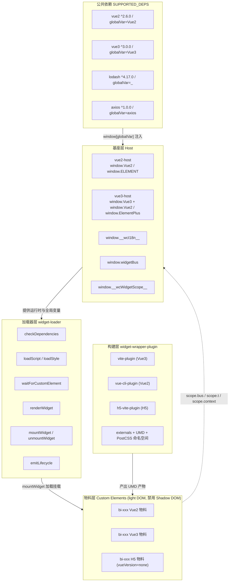
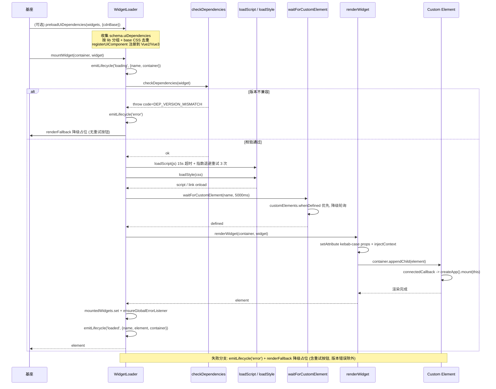
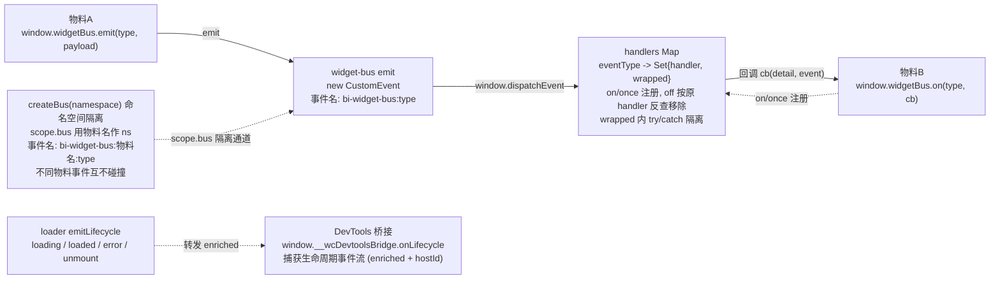
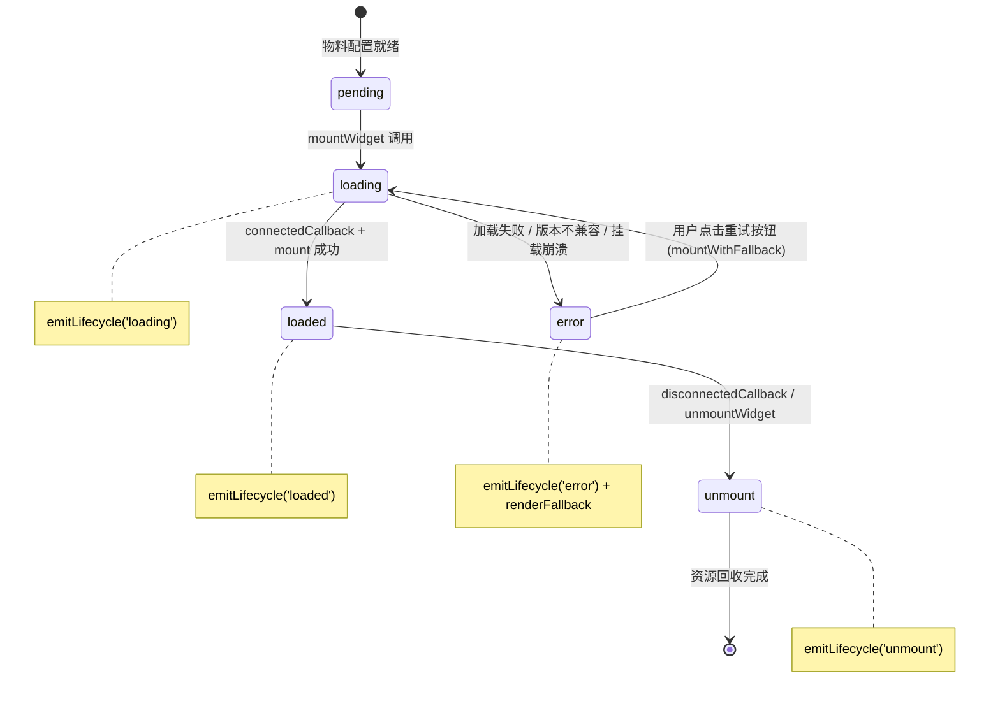
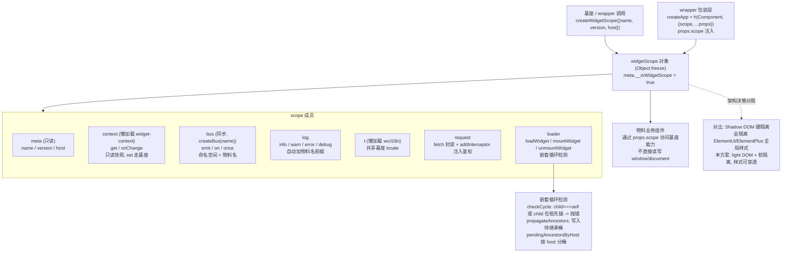
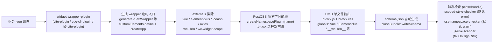
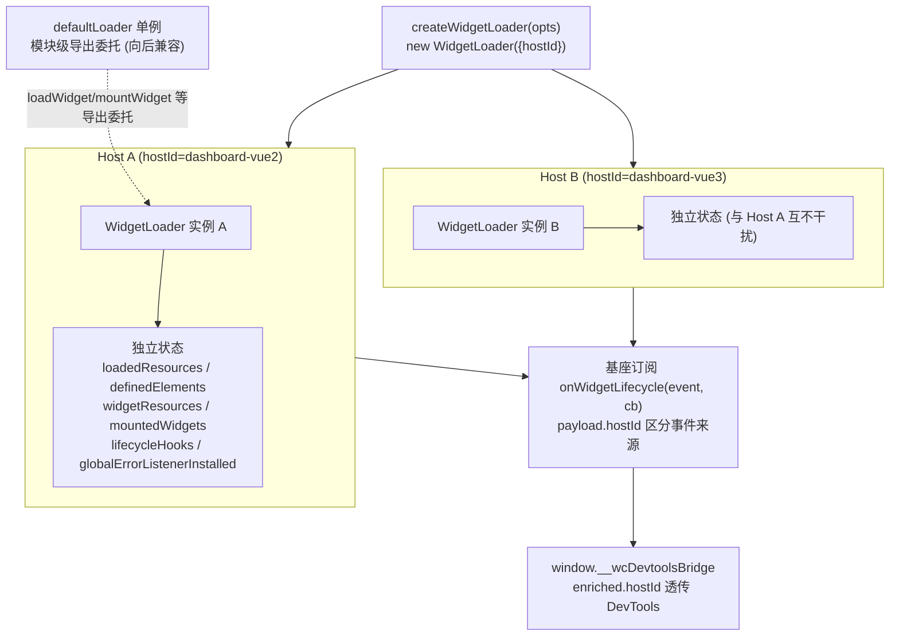
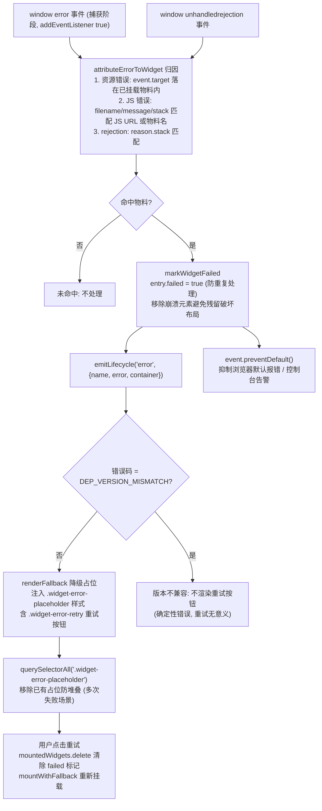

# wc 物料架构图集

本文档用 Mermaid 图系统性可视化整个 wc 物料架构，作为 `architecture.md` 的图解补充。所有图均基于源码真实结构，节点名、方法名、事件名、错误码、全局变量名与源码一致。

源码索引：

- `wc/widget-loader/index.js`：`WidgetLoader` 类、`SUPPORTED_DEPS`、`checkDependencies`、`loadScript`/`loadStyle`、`waitForCustomElement`、`renderWidget`、`mountWidget`/`unmountWidget`、`attemptMount`/`mountWithFallback`、`emitLifecycle`、`preloadUiDependencies`、错误边界
- `wc/widget-wrapper-plugin/vite-plugin.js`：`generateVue3Wrapper`、`externals`、`customElements.define`、PostCSS 命名空间、`closeBundle` 静态检查
- `wc/widget-bus/index.js`：`widgetBus.emit/on/once/off`、`createBus`、`window.widgetBus`
- `wc/widget-scope/index.js`：`createWidgetScope`、软隔离 scope、嵌套循环检测
- `wc/widget-context/index.js`：`injectContext`、`setContext`/`getContext`/`onContextChange`
- `wc/i18n/index.js`：`t()`、`setLocale`、`window.__wcI18n__`
- `agent.md`：5 条核心架构决策

---

## 图1：系统总览架构图

本图展示基座（host）↔ 物料（widget）↔ 公共运行时的整体分层关系。基座层提供 Vue2/Vue3 运行时与 `__wcI18n__`/`widgetBus`/`__wcWidgetScope__` 全局变量；加载器层负责依赖校验、资源加载、Custom Element 等待与渲染；物料层是三种技术栈的 `bi-*` Custom Elements（light DOM）；构建层把业务组件包装为 UMD 产物；公共依赖 `SUPPORTED_DEPS` 通过 `window[globalVar]` 注入。

---

## 图2：物料加载管线时序图

本图展示基座调用 `mountWidget` 到物料渲染完成的完整时序，以及失败降级分支。`mountWidget` 内部委托 `attemptMount`：先 `emitLifecycle('loading')`，再 `loadWidget`（内含 `checkDependencies` → `loadScript`/`loadStyle` → `waitForCustomElement`），然后 `renderWidget` 写入 kebab-case attribute 并 `appendChild` 触发 `connectedCallback`。`preloadUiDependencies` 是基座可选的预加载步骤（按 lib 分组、base CSS 去重、注册到 Vue 运行时）。失败时 `emitLifecycle('error')` + `renderFallback` 降级占位，版本不兼容（`DEP_VERSION_MISMATCH`）不渲染重试按钮。

---

## 图3：跨物料通信架构图

本图展示 `widget-bus` 事件总线机制。全局总线 `window.widgetBus`（默认 `busName=bi-widget-bus`）通过 `window.dispatchEvent(CustomEvent)` 派发，事件名为 `bi-widget-bus:type`；`createBus(namespace)` 创建命名空间隔离总线，事件名为 `bi-widget-bus:ns:type`，`scope.bus` 用物料名作 ns，不同物料事件互不碰撞。`handlers` Map 按 `eventType -> Set{handler, wrapped}` 管理，`wrapped` 内 try/catch 隔离避免单个 handler 抛异常阻断同类型监听器。DevTools 桥接 `window.__wcDevtoolsBridge.onLifecycle` 捕获 loader 侧 `emitLifecycle` 的生命周期事件流（与 bus 业务事件相互独立）。

---

## 图4：物料生命周期状态图

本图展示物料的完整生命周期状态。`pending`（配置就绪）→ `loading`（`mountWidget` 调用）→ `loaded`（`connectedCallback` + mount 成功）或 `error`（加载失败/版本不兼容/挂载崩溃）；`loaded` → `unmount`（`disconnectedCallback` 或 `unmountWidget`）；`error` → `loading`（用户点击重试按钮走 `mountWithFallback`）。各状态转换对应 `emitLifecycle` 事件。

---

## 图5：软隔离 Scope 结构图

本图展示 `widgetScope` 软隔离对象的注入机制。基座/wrapper 调用 `createWidgetScope({name, version, host})` 生成 `Object.freeze` 的 scope 对象，含 `meta`/`context`/`bus`/`log`/`t`/`request`/`loader` 成员；wrapper 把 scope 通过 `props.scope` 注入物料业务组件，物料通过 `scope.*` 访问基座能力而非直接访问 `window`。`loader` 成员支持嵌套加载子物料并带循环检测（`checkCycle`/`propagateAncestors`，多 Host 按 `pendingAncestorsByHost` 分桶）。与 Shadow DOM 硬隔离对比：本方案用 light DOM + 软隔离，保证 ElementUI/ElementPlus 全局样式穿透。

---

## 图6：构建流程图

本图展示物料构建流程。业务 `.vue` 组件经 `widget-wrapper-plugin`（vite/vue-cli/h5 三种）生成 wrapper（`customElements.define` + `createApp`/`new Vue`/`render`），通过 `externals` 排除 vue/element-plus/lodash/axios/wc-i18n/wc-widget-scope，PostCSS `createNamespacePlugin(name)` 自动加 `.bi-xxx` 选择器前缀，最终 UMD 单文件输出（`bi-xxx.js` + `bi-xxx.css`，globals 映射全局变量）。`closeBundle` 钩子自动生成 `schema.json` 并执行三项静态检查：scoped CSS、CSS 命名空间、JS 危险 API。

---

## 图7：多 Host 状态隔离图

本图展示 `createWidgetLoader` 多实例隔离机制。每个 Host 通过 `createWidgetLoader({hostId})` 创建独立的 `WidgetLoader` 实例，持有独立的 `loadedResources`/`definedElements`/`widgetResources`/`mountedWidgets`/`lifecycleHooks`/`globalErrorListenerInstalled`，避免微前端/iframe 嵌套场景下 A Host 的加载记录干扰 B Host。`emitLifecycle` 在 payload 上附加 `hostId`，基座订阅 `onWidgetLifecycle` 时可据此区分事件来源。模块级 `defaultLoader` 单例委托保持向后兼容。

---

## 图8：错误边界与降级流程图

本图展示错误归因与降级机制。`ensureGlobalErrorListener` 在首次挂载物料时安装捕获阶段 `error` 监听与 `unhandledrejection` 监听；`attributeErrorToWidget` 归因：资源错误看 `event.target` 是否落在已挂载物料内，JS 错误按 `filename`/`message`/`stack` 匹配物料 JS URL 或物料名。命中后 `markWidgetFailed` 置 `entry.failed=true`、移除崩溃元素、`emitLifecycle('error')`、`renderFallback` 渲染降级占位（含重试按钮）。`renderFallback` 用 `querySelectorAll('.widget-error-placeholder')` 移除已有占位防堆叠。`unhandledrejection` 命中后 `preventDefault` 抑制控制台告警。

---

## 附：架构决策与图对照

| 决策（agent.md） | 对应图 |
| --- | --- |
| 1. Custom Elements + light DOM，禁用 Shadow DOM | 图1、图5、图6 |
| 2. UMD + external，基座统一提供运行时 | 图1、图6 |
| 3. 扁平化 props 协议（kebab-case attribute） | 图2 |
| 4. 软隔离 widgetScope | 图5 |
| 5. 构建时静态分析 | 图6 |
