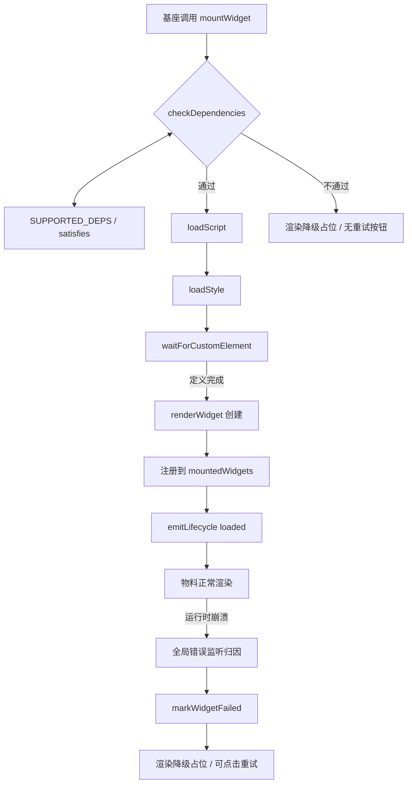

# 微前端看板技术架构说明

本文档面向需要理解项目内部实现的前端开发者，系统介绍跨 Vue 2 / Vue 3 技术栈的可复用看板物料（widget）是如何被基座（host）加载、隔离、通信与打包的。

## 目录

1. [架构总览](#1-架构总览)
2. [Vue 2 / Vue 3 双运行时隔离](#2-vue-2--vue-3-双运行时隔离)
3. [物料加载管线](#3-物料加载管线)
4. [版本契约](#4-版本契约)
5. [错误边界](#5-错误边界)
6. [生命周期钩子](#6-生命周期钩子)
7. [外部依赖与全局变量](#7-外部依赖与全局变量)
8. [打包流程](#8-打包流程)
9. [跨物料通信](#9-跨物料通信)

---

## 1. 架构总览

项目由三个层次组成：

- **基座（Host）**：负责提供运行时环境、加载物料、渲染看板。
  - `demo/vue2-host`：纯 Vue 2 基座，仅挂载 `window.Vue2`。
  - `demo/vue3-host`：Vue 3 基座，同时挂载 `window.Vue3` 与 `window.Vue2`。
- **运行时基础设施**：`wc/widget-loader`、`wc/widget-bus`、`wc/i18n`。
- **物料（Widget）**：独立的 `.js` + `.css` 产物，通过 Custom Element 注册到页面。

```text
┌─────────────────────────────────────────────────────────────┐
│                         基座 Host                            │
│  ┌─────────────┐  ┌─────────────┐  ┌─────────────────────┐  │
│  │  Vue2 Host  │  │  Vue3 Host  │  │  widget-loader      │  │
│  │ window.Vue2 │  │ window.Vue3 │  │  (load / mount /    │  │
│  │             │  │ window.Vue2 │  │   error boundary)   │  │
│  └──────┬──────┘  └──────┬──────┘  └──────────┬──────────┘  │
│         │                │                    │             │
│         └────────────────┴────────────────────┘             │
│                          │                                  │
│              通过全局变量 / CustomEvent 互通                 │
└──────────────────────────┬──────────────────────────────────┘
                           │
┌──────────────────────────┼──────────────────────────────────┐
│                          ▼                                  │
│                    物料 Widget (UMD)                         │
│   ┌─────────────────────┐  ┌─────────────────────────────┐  │
│   │ bi-sales-panel.js   │  │ bi-finance-panel.js         │  │
│   │ Vue 2 物料          │  │ Vue 3 物料                  │  │
│   │ external: vue/element-ui   │  │ external: vue/element-ui           │  │
│   └─────────────────────┘  └─────────────────────────────┘  │
└─────────────────────────────────────────────────────────────┘
```

---

## 2. Vue 2 / Vue 3 双运行时隔离

### 2.1 为什么需要两个基座

Vue 2 与 Vue 3 的响应式系统、编译器、组件 API 互不兼容。若把两个版本的 Vue 同时打包进一个基座：

- 包体积翻倍；
- 全局组件/指令命名冲突；
- 无法保证物料真正运行在对应版本的 Vue 上。

因此项目采用「**运行时隔离 + 全局变量约定**」的方案：

- **Vue 2 基座**只提供 `window.Vue2`，不加载 Vue 3；
- **Vue 3 基座**提供 `window.Vue3`，并额外通过 CDN 加载 Vue 2 挂载到 `window.Vue2`，从而能同时承载 Vue 2 与 Vue 3 物料。

```js
// demo/vue2-host/src/main.js
import Vue from 'vue';
window.Vue2 = Vue;          // 仅暴露 Vue2

// demo/vue3-host/src/main.js
import * as Vue from 'vue';
window.Vue3 = Vue;          // 暴露 Vue3

// demo/vue3-host/index.html
<script src="https://unpkg.com/vue@2/dist/vue.js"></script>
<script>window.Vue2 = window.Vue;</script>
```

### 2.2 物料如何被隔离

每个物料被打包成独立的 UMD 文件，并声明自身依赖的 Vue 主版本 `vueVersion: '2' | '3'`。`widget-loader` 在加载前按该字段选择对应的全局变量（`Vue2` 或 `Vue3`）做版本校验，详见 [第 4 章](#4-版本契约)。

物料本身不会把 Vue 打包进产物，而是通过 `externals` 在运行时使用基座注入的全局对象，从而保证：

- Vue 2 物料始终使用 `window.Vue2`；
- Vue 3 物料始终使用 `window.Vue3`；
- 不会出现两个版本的 Vue 被重复打包到同一个 widget 中的问题。

### 2.3 全局变量约定

| 全局变量 | 含义 | 注入位置 |
| --- | --- | --- |
| `window.Vue2` | Vue 2 运行时 | `demo/vue2-host/src/main.js` / `demo/vue3-host/index.html` |
| `window.Vue3` | Vue 3 运行时 | `demo/vue3-host/src/main.js` |
| `window.__wcI18n__` | 跨技术栈国际化运行时 | `wc/i18n/index.js` |
| `window.widgetBus` | 跨物料消息总线 | `wc/widget-bus/index.js` |

---

## 3. 物料加载管线

`wc/widget-loader/index.js` 是基座与物料之间的核心桥梁，提供从资源加载到 DOM 渲染的完整管线。

### 3.1 加载流程图



### 3.2 关键函数说明

#### `loadScript(url, timeout)` / `loadStyle(url, timeout)`

- 使用 `<script>` / `<link>` 标签动态加载 JS / CSS；
- 通过 `loadedResources` Map 做去重缓存，避免同一 URL 被重复加载；
- 支持超时清理，默认 15 秒，超时会移除节点并 reject。

```js
// wc/widget-loader/index.js:151-240
function loadScript(url, timeout = DEFAULT_LOAD_TIMEOUT) { /* ... */ }
function loadStyle(url, timeout = DEFAULT_LOAD_TIMEOUT) { /* ... */ }
```

#### `waitForCustomElement(name, timeout)`

脚本执行后，物料内部会调用 `customElements.define(name, WidgetElement)`。loader 通过轮询 `customElements.get(name)` 等待注册完成，默认超时 5 秒。返回的 Promise 还带有 `cancel()` 方法，调用方放弃等待时可清理定时器。

```js
// wc/widget-loader/index.js:248-279
function waitForCustomElement(name, timeout = 5000) { /* ... */ }
```

#### `renderWidget(container, widget)`

创建目标 Custom Element 实例，并把 `widget.config` JSON 序列化后写入 `config` 属性，最后 append 到基座容器。该操作会触发物料 wrapper 的 `connectedCallback()`。

```js
// wc/widget-loader/index.js:533-547
export function renderWidget(container, widget) {
  const { name, config = {} } = widget;
  const element = document.createElement(name);
  element.setAttribute('config', JSON.stringify(config));
  container.appendChild(element);
  return element;
}
```

#### `mountWidget(container, widget)`

对外的挂载入口，内部调用 `attemptMount`：

- 成功：返回 Custom Element 实例；
- 失败：根据错误类型渲染降级占位，版本不兼容（`DEP_VERSION_MISMATCH`）时不提供重试按钮，其他失败提供「点击重试」。

```js
// wc/widget-loader/index.js:599-616
export async function mountWidget(container, widget) { /* ... */ }
```

#### `unmountWidget(element)`

从 DOM 中移除物料元素，清理 `mountedWidgets` 中的追踪记录，并触发 `unmount` 生命周期事件。

```js
// wc/widget-loader/index.js:622-632
export function unmountWidget(element) { /* ... */ }
```

---

## 4. 版本契约

为了避免「Vue 3 物料在 Vue 2 基座上跑起来后才发现不兼容」这类晦涩运行时错误，项目在加载前强制进行依赖版本契约检查。

### 4.1 `SUPPORTED_DEPS`

基座承诺提供的运行时版本与兼容范围，定义在 `wc/widget-loader/index.js:18-22`：

```js
const SUPPORTED_DEPS = {
  vue2: { version: '2.6.14', compatibleRange: '^2.6.0', globalVar: 'Vue2' },
  vue3: { version: '3.4.21', compatibleRange: '^3.0.0', globalVar: 'Vue3' }
};
```

### 4.2 `satisfies(version, range)`

轻量 semver 实现，支持 `^`、`~`、`>=`、`>`、`<=`、`<`、`=` 与精确版本，避免引入完整 semver 库增加体积。

```js
// wc/widget-loader/index.js:43-82
export function satisfies(version, range) { /* ... */ }
```

### 4.3 `checkDependencies(widget)`

根据物料声明的 `widget.vueVersion` 选择 `vue2` 或 `vue3` 条目，检查：

1. 全局变量是否存在；
2. 运行时版本是否落在 `compatibleRange` 内。

任一不通过都会抛出 `code = 'DEP_VERSION_MISMATCH'` 的错误，错误信息通过 `wc/i18n` 翻译。

```js
// wc/widget-loader/index.js:91-126
export function checkDependencies(widget) { /* ... */ }
```

### 4.4 拒绝加载示例

在 `demo/vue2-host/src/widgetRegistry.js` 中，`bi-finance-panel` 被声明为 `vueVersion: '3'`。由于 Vue 2 基座没有 `window.Vue3`，loader 会直接拒绝加载并渲染占位提示：

```js
{
  name: 'bi-finance-panel',
  vueVersion: '3',
  js: '/widgets/bi-finance-panel.js',
  // ...
}
```

---

## 5. 错误边界

### 5.1 设计目标

- 单个物料崩溃不拖垮整个看板；
- 自动捕获运行时错误并归因；
- 提供可点击重试，重试只影响当前物料。

### 5.2 `mountedWidgets` WeakMap

以 Custom Element 实例为 key 记录其挂载容器、配置与失败状态。使用 `WeakMap` 的好处：

- 同一物料多实例互不覆盖；
- 元素被 GC 后记录自动回收，避免内存泄漏。

```js
// wc/widget-loader/index.js:339
const mountedWidgets = new WeakMap(); // element -> { container, widget, failed }
```

### 5.3 全局错误监听与归因

`ensureGlobalErrorListener()` 在首次挂载物料时安装一次全局监听器：

- `window.addEventListener('error', ..., true)`：捕获资源加载失败与 JS 运行时错误；
- `window.addEventListener('unhandledrejection', ...)`：捕获未处理的 Promise rejection。

错误归因逻辑 `attributeErrorToWidget` 按以下优先级匹配：

1. 资源错误：如果 `event.target` 是某个已挂载物料内部的元素，则归因到该物料；
2. JS 运行时错误：按 `event.filename`、`event.message`、`error.stack` 匹配物料 JS URL 或物料名。

```js
// wc/widget-loader/index.js:463-489
function attributeErrorToWidget(event) { /* ... */ }
```

### 5.4 降级渲染

命中错误后，`markWidgetFailed()` 会：

1. 设置 `entry.failed = true`，避免重复处理；
2. 移除崩溃的 Custom Element，防止残留破坏布局；
3. 触发 `error` 生命周期事件；
4. 渲染 `.widget-error-placeholder` 占位节点，附带「点击重试」按钮；
5. 重试时重新调用 `mountWithFallback`，不影响其他物料。

```js
// wc/widget-loader/index.js:441-461
function markWidgetFailed(element, error) { /* ... */ }
```

### 5.5 样式主题化

降级占位样式由 `injectFallbackStyles()` 注入一次，基座可通过覆盖 `.widget-error-placeholder` / `.widget-error-retry` 类实现自定义主题，无需修改 loader 源码。

---

## 6. 生命周期钩子

基座可以通过 `onWidgetLifecycle` 订阅物料的加载状态，用于统一监控、埋点或日志展示。

### 6.1 支持的事件

| 事件名 | 触发时机 | payload |
| --- | --- | --- |
| `loading` | 开始加载物料 | `{ name, container }` |
| `loaded` | 物料挂载成功 | `{ name, element, container }` |
| `error` | 加载或运行时失败 | `{ name, error, container }` |
| `unmount` | 物料被卸载 | `{ name, element, container }` |

### 6.2 订阅与取消订阅

```js
// wc/widget-loader/index.js:358-365
export function onWidgetLifecycle(event, cb) {
  if (!lifecycleHooks[event]) return () => {};
  lifecycleHooks[event].push(cb);
  return () => { /* 移除回调 */ };
}
```

### 6.3 基座使用示例

`demo/vue2-host/src/App.vue` 中使用 widget-bus 监听 `widget:loaded` 事件（注意：widget-bus 监听的是业务层事件，loader 生命周期用于 loader 内部状态）：

```js
this.unsubscribe = on('widget:loaded', payload => {
  this.logs.push(`[loaded] ${payload.widget}`);
});
```

而 loader 自身的生命周期在 `attemptMount` / `mountWidget` / `unmountWidget` 内部通过 `emitLifecycle` 触发，详见 `wc/widget-loader/index.js:346-350` 与 `556-626`。

---

## 7. 外部依赖与全局变量

### 7.1 物料构建时的 externals

Vue 2 与 Vue 3 物料在打包时都把公共依赖设为 `external`，避免重复打包：

```js
// wc/widget-wrapper-plugin/vite-plugin.js:116-125
rollupOptions: {
  external: ['vue', 'element-ui', 'wc-i18n'],
  output: {
    globals: {
      vue: vueGlobal,          // 默认 'Vue'
      'element-ui': 'ELEMENT',
      'wc-i18n': '__wcI18n__'
    }
  }
}
```

```js
// wc/widget-wrapper-plugin/vue-cli-plugin.js:102-108
config.externals({
  vue: vueGlobal,
  'element-ui': 'ELEMENT',
  'wc-i18n': '__wcI18n__'
});
```

### 7.2 基座如何注入这些全局变量

| 依赖 | 基座注入方式 | 物料引用方式 |
| --- | --- | --- |
| Vue | `window.Vue2 = Vue` / `window.Vue3 = Vue` | `import Vue from 'vue'`（构建时 external） |
| ElementUI | 基座 `import './element-ui.js'` | 构建时 external |
| wc-i18n | `wc/i18n/index.js` 自动挂载 `window.__wcI18n__` | `import { t } from 'wc-i18n'`（构建时 external） |
| widget-bus | `wc/widget-bus/index.js` 自动挂载 `window.widgetBus` | 直接 `import { emit, on } from '../../../wc/widget-bus'` |

### 7.3 为什么不把 Vue 打包进物料

- 体积：每个 widget 都打包 Vue 会导致看板整体体积随物料数量线性增长；
- 隔离：通过全局变量可以确保物料运行在基座承诺的 Vue 版本上，并由版本契约校验；
- 一致性：多个 Vue 2 物料共享同一个 `window.Vue2`，避免全局状态碎片化。

---

## 8. 打包流程

物料最终产物是一个 UMD 包，包含：

- 一个 Custom Element 包装器（手写，非 Shadow DOM）；
- 业务 Vue 组件；
- 可选的 CSS；
- 自动生成的 `schema.json`。

### 8.1 两种打包插件

| 插件 | 用途 | 对应物料 |
| --- | --- | --- |
| `wc/widget-wrapper-plugin/vue-cli-plugin.js` | Vue CLI / webpack 项目 | Vue 2 物料 |
| `wc/widget-wrapper-plugin/vite-plugin.js` | Vite / rollup 项目 | Vue 3 物料 |

### 8.2 Vue 2 包装器

`vue-cli-plugin.js` 生成临时入口文件，动态替换 webpack entry。包装器核心逻辑：

```js
// wc/widget-wrapper-plugin/vue-cli-plugin.js:20-68
function generateVue2Wrapper(widgetName, vueGlobal) {
  return `
import Vue from 'vue';
import Component from '__WIDGET_COMPONENT__';

class WidgetElement extends HTMLElement {
  // ...
  connectedCallback() {
    const config = this.getAttribute('config');
    this.vm = new Vue({
      render: h => h(Component, { props: { config: parseConfig(config) } })
    });
    this.vm.$mount();
    this.appendChild(this.vm.$el);
  }
  disconnectedCallback() {
    if (this.vm) { this.vm.$destroy(); this.vm = null; }
  }
  // ...
}
customElements.define('${widgetName}', WidgetElement);
`;
}
```

### 8.3 Vue 3 包装器

`vite-plugin.js` 同样生成临时入口，手写 `HTMLElement` + `createApp()`，**不使用 `defineCustomElement()`**，因为后者默认创建 Shadow DOM，会隔离 ElementUI/ElementPlus 全局样式。

```js
// wc/widget-wrapper-plugin/vite-plugin.js:25-90
function generateVue3Wrapper(widgetName, vueGlobal) {
  return `
import { createApp, h } from 'vue';
import Component from '__WIDGET_COMPONENT__';

class WidgetElement extends HTMLElement {
  // ...
  _mount() {
    if (this.app) { this.app.unmount(); this.app = null; }
    const config = this.getAttribute('config');
    this.app = createApp({
      render: () => h(Component, { config: parseConfig(config) })
    });
    this.app.mount(this); // 挂载到 light DOM
  }
  // ...
}
customElements.define('${widgetName}', WidgetElement);
`;
}
```

### 8.4 不使用 Shadow DOM 的决策

项目明确禁止使用 Shadow DOM，原因：

- ElementUI/ElementPlus 全局样式、主题变量、字体图标需要穿透到物料内部；
- Shadow DOM 会导致基座统一主题失效；
- 手写 HTMLElement 挂载到 light DOM 可以保持样式一致性。

这一点在 `wc/vue2-widget-template/widget-wrapper.js`、`wc/vue3-widget-template/widget-wrapper.js` 与两个插件的 wrapper 代码中均有明确注释。

### 8.5 schema.json 自动生成

两个插件在构建完成后都会调用 `schema-generator` 为业务组件生成 `schema.json`，用于描述物料的 props 与配置结构。

---

## 9. 跨物料通信

`wc/widget-bus/index.js` 提供一个基于原生 `CustomEvent` 的全局消息总线，Vue 2、Vue 3 与原生 JS 均可使用。

### 9.1 核心 API

```js
// wc/widget-bus/index.js:16-54
export function emit(type, payload, options = {}) { /* ... */ }
export function on(type, handler) { /* ... */ }
export function once(type, handler) { /* ... */ }
```

事件名统一加上前缀 `bi-widget-bus:`，例如 `emit('refresh-data')` 实际派发的事件名为 `bi-widget-bus:refresh-data`。

### 9.2 Vue 插件形式

提供 Vue 2 / Vue 3 两种插件安装方式：

```js
// wc/widget-bus/index.js:60-80
export const Vue2BusPlugin = {
  install(Vue) { Vue.prototype.$widgetBus = { emit, on, once }; }
};

export const Vue3BusPlugin = {
  install(app) { app.config.globalProperties.$widgetBus = { emit, on, once }; }
};
```

### 9.3 全局挂载

非 Vue 代码可直接使用 `window.widgetBus`：

```js
// wc/widget-bus/index.js:85-87
if (typeof window !== 'undefined') {
  window.widgetBus = { emit, on, once };
}
```

### 9.4 国际化同步中的应用

`wc/i18n/index.js` 在语言切换时通过 `widgetBus` 广播 `locale-change` 事件，物料监听后即可重渲染：

```js
// wc/i18n/index.js:59-71
function setLocale(locale, force = false) {
  // ...
  if (typeof window !== 'undefined' && window.widgetBus) {
    window.widgetBus.emit('locale-change', { locale });
  }
}
```

### 9.5 基座使用示例

```js
// demo/vue2-host/src/App.vue:77
emit('refresh-data', { source: 'vue2-host', timestamp: Date.now() });
```

---

## 10. 补充：国际化运行时

`wc/i18n/index.js` 是一个与 Vue 版本无关的轻量国际化运行时，用于统一 widget-loader 错误提示与物料业务文案。

### 10.1 为什么不直接用 vue-i18n

vue-i18n@8 与 @9 的 UMD 全局名都是 `VueI18n`，跨技术栈物料共存时无法同时 external。因此基座 Vue UI 层仍用 vue-i18n，而 loader、物料统一用 `wc/i18n`。

### 10.2 关键 API

```js
// wc/i18n/index.js:28-103
function t(key, params) { /* ... */ }
function getLocale() { /* ... */ }
function setLocale(locale, force = false) { /* ... */ }
function onLocaleChange(cb) { /* ... */ }
function addMessages(locale, msgs) { /* ... */ }
```

基座切换语言时同步更新 `wc/i18n` 的 locale，例如 `demo/vue2-host/src/i18n.js:52-55`：

```js
export function changeLocale(locale) {
  i18n.locale = locale;
  setLocale(locale); // 同步 widget-loader / 物料
}
```

---

## 11. 总结

本项目通过以下设计实现跨 Vue 2 / Vue 3 的看板物料体系：

1. **双运行时隔离**：基座按场景选择暴露 `Vue2` / `Vue3`，物料通过 externals 复用全局运行时；
2. **版本契约**：加载前校验依赖版本，拒绝不兼容物料，避免晦涩运行时错误；
3. **错误边界**：WeakMap 追踪 + 全局错误归因 + 降级占位，实现单点失败不影响整体；
4. **生命周期钩子**：基座可订阅 loading / loaded / error / unmount 事件；
5. **light DOM 包装器**：手写 Custom Element，不用 Shadow DOM，保证 ElementUI/ElementPlus 样式穿透；
6. **跨物料通信**：基于 CustomEvent 的 widget-bus，支持 Vue 2 / Vue 3 / 原生 JS；
7. **独立国际化运行时**：`wc/i18n` 作为跨技术栈文案同步枢纽。

关键文件索引：

- `wc/widget-loader/index.js`：加载、挂载、版本契约、错误边界、生命周期；
- `wc/widget-wrapper-plugin/vite-plugin.js`：Vue 3 物料打包；
- `wc/widget-wrapper-plugin/vue-cli-plugin.js`：Vue 2 物料打包；
- `wc/vue2-widget-template/widget-wrapper.js`：Vue 2 运行时包装器模板；
- `wc/vue3-widget-template/widget-wrapper.js`：Vue 3 运行时包装器模板；
- `wc/i18n/index.js`：跨技术栈国际化；
- `wc/widget-bus/index.js`：跨物料消息总线；
- `demo/vue2-host/src/main.js`、`demo/vue3-host/src/main.js`：基座入口与全局变量注入；
- `demo/vue2-host/src/widgetRegistry.js`、`demo/vue3-host/src/widgetRegistry.js`：基座物料注册表。
