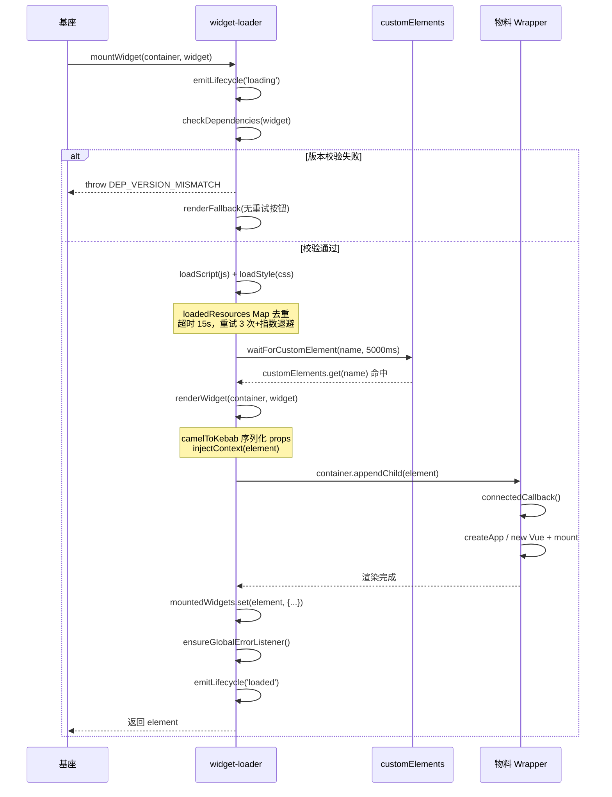
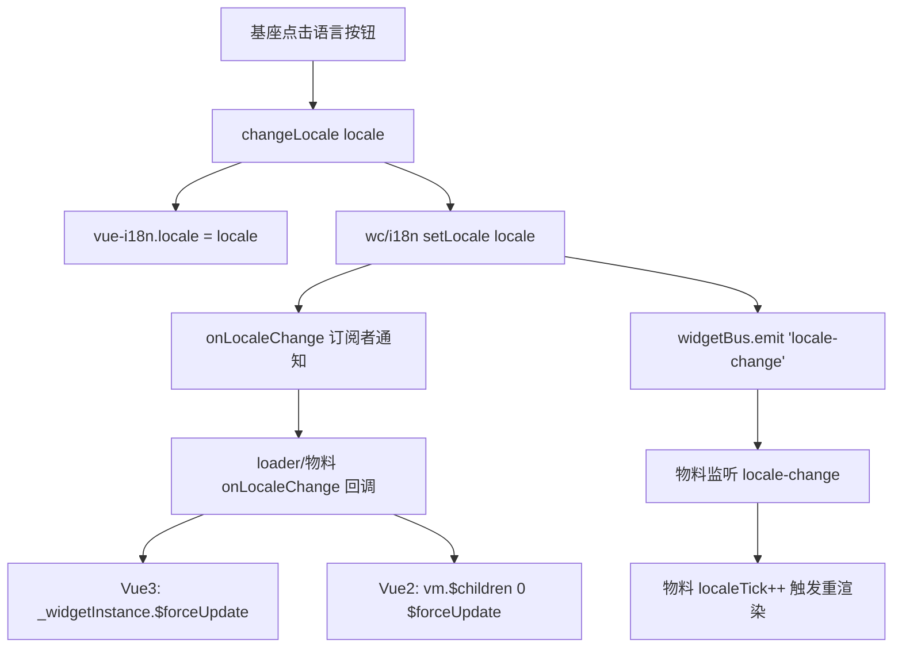
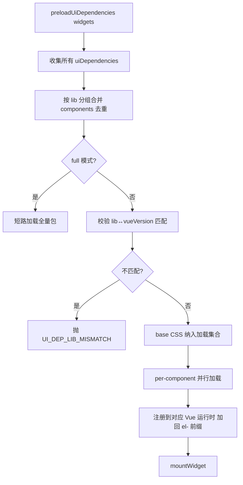
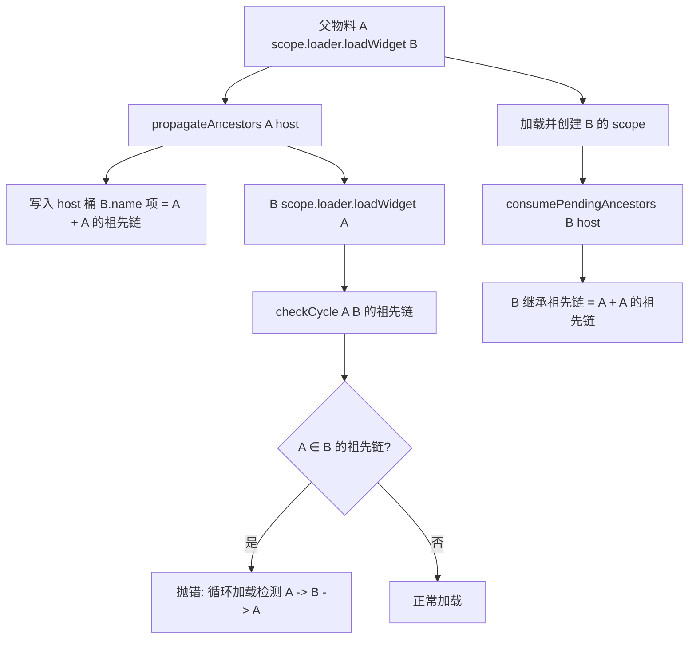

# 跨技术栈看板物料集成方案 总体设计文档

> 本文档基于实际代码实现逆向输出，描述系统架构、模块设计、关键决策与数据流。与 `docs/spec-requirements.md`（需求规格）、`docs/technical-implementation.md`（关键技术实现）配套使用。

---

## 目录

1. [系统架构总览](#1-系统架构总览)
2. [分层架构](#2-分层架构)
3. [模块设计](#3-模块设计)
4. [核心架构决策](#4-核心架构决策)
5. [关键数据流](#5-关键数据流)
6. [数据结构与接口设计](#6-数据结构与接口设计)
7. [构建与产物设计](#7-构建与产物设计)
8. [错误处理与降级设计](#8-错误处理与降级设计)
9. [隔离与安全设计](#9-隔离与安全设计)
10. [扩展点与演进方向](#10-扩展点与演进方向)

---

## 1. 系统架构总览

### 1.1 三层架构

```text
┌─────────────────────────────────────────────────────────────────┐
│                          基座 Host                               │
│  ┌──────────────┐  ┌──────────────┐  ┌────────────────────────┐ │
│  │  Vue2 Host   │  │  Vue3 Host   │  │     widget-loader       │ │
│  │ window.Vue2  │  │ window.Vue3  │  │  load / mount / version │ │
│  │ window.ELEMENT│ │ window.Vue2  │  │  contract / error bound│ │
│  │              │  │ window.ElementPlus│ │  / lifecycle         │ │
│  └──────┬───────┘  └──────┬───────┘  └────────────┬───────────┘ │
│         │                 │                       │             │
│         └─────────────────┴───────────────────────┘             │
│                           │                                     │
│              通过全局变量 / CustomEvent / widgetScope 互通          │
└───────────────────────────┼─────────────────────────────────────┘
                            │
┌───────────────────────────┼─────────────────────────────────────┐
│                           ▼                                     │
│                    物料 Widget (UMD)                              │
│   ┌─────────────────────┐  ┌─────────────────────────────────┐ │
│   │  Vue2 物料           │  │  Vue3 物料 / H5 物料             │ │
│   │  bi-sales-panel.js   │  │  bi-finance-panel.js            │ │
│   │  external: vue/       │  │  external: vue/element-plus/   │ │
│   │  element-ui/wc-i18n   │  │  wc-i18n/wc-widget-scope        │ │
│   └─────────────────────┘  └─────────────────────────────────┘ │
└─────────────────────────────────────────────────────────────────┘
```

### 1.2 运行时基础设施层

基座与物料之间通过以下基础设施互通：

| 设施 | 职责 | 实现 |
| ------ | ------ | ------ |
| 全局变量桥 | 基座注入 Vue / ElementUI / i18n / scope 等运行时 | `window.Vue2` / `window.Vue3` / `window.__wcI18n__` 等 |
| widget-bus | 跨技术栈消息通信 | 基于原生 `CustomEvent` + `window.dispatchEvent` |
| widget-context | 全局只读上下文注入 | `window.__wcContext__` + widget-bus 广播 |
| widget-scope | 物料软隔离受控 API | `Object.freeze` scope 对象 + 嵌套加载循环检测 |
| widget-loader | 按需加载、版本契约、错误边界 | `WidgetLoader` 类 + 模块级单例委托 |

### 1.3 构建期工具链层

| 工具 | 职责 | 集成方式 |
| ------ | ------ | ------ |
| widget-wrapper-plugin | Vue2/Vue3/H5 组件 → UMD Custom Element | Vue CLI `chainWebpack` / Vite plugin |
| schema-generator | 扫描 props 生成 `schema.json` | `closeBundle` / `done` 钩子调用 |
| postcss-namespace | CSS 选择器自动加 `.bi-xxx` 前缀 | PostCSS 插件 + webpack/Vite 集成 |
| scoped-style-checker | 强制 `<style scoped>` | 构建期检查（4 种 policy） |
| css-namespace-checker | CSS 命名空间检查 | postcss AST 优先，回退手写状态机 |
| js-risk-scanner | 危险 API 扫描 | acorn AST 优先，回退正则 |
| dependency-analyzer | 依赖冲突分析 + externals 推荐 | 独立 CLI |

---

## 2. 分层架构

### 2.1 分层模型

```text
┌─────────────────────────────────────────────────────────┐
│  业务层：看板布局 / 拖拽 / 配置表单（基座业务自实现）          │
├─────────────────────────────────────────────────────────┤
│  编排层：widget-page（页面状态机 / 物料归属权跟踪）           │
├─────────────────────────────────────────────────────────┤
│  加载层：widget-loader（按需加载 / 版本契约 / 错误边界）      │
│         widget-registry（三级降级注册表）                   │
│         preloadUiDependencies（UI 组件按需加载）            │
├─────────────────────────────────────────────────────────┤
│  通信层：widget-bus（CustomEvent 总线）                     │
│         widget-context（全局只读上下文）                    │
│         i18n（跨技术栈国际化）                              │
├─────────────────────────────────────────────────────────┤
│  隔离层：widget-scope（软隔离受控 API + 嵌套循环检测）       │
├─────────────────────────────────────────────────────────┤
│  包装层：widget-wrapper-plugin（Vue2/Vue3/H5 → Custom Element）│
│         vue2/vue3/h5-widget-template（手写 HTMLElement）   │
├─────────────────────────────────────────────────────────┤
│  质量层：schema-generator / 4 个 checker / migration-skill │
│         ai-assistant / ai-schema-enricher                │
├─────────────────────────────────────────────────────────┤
│  调试层：devtools-extension（MV3 浏览器扩展）                │
├─────────────────────────────────────────────────────────┤
│  声明式层：widget-declarative-plugin（$widget 宏 / JSX）    │
└─────────────────────────────────────────────────────────┘
```

### 2.2 依赖方向

依赖方向严格自上而下，下层不依赖上层：

- **业务层** 依赖 **编排层**（PageManager）与 **加载层**（mountWidget）。
- **编排层** 依赖 **加载层**（createWidgetLoader）。
- **加载层** 依赖 **通信层**（i18n 翻译错误信息）与 **隔离层**（injectContext）。
- **隔离层** 同步引入 **通信层**（widget-bus / widget-context / i18n），懒加载 **加载层**（widget-loader）。
  - K2 改进：原 `widget-context` / `i18n` 懒加载导致 `scope.context.get` / `scope.t` 与全局 API 异步语义不一致，现统一同步引入，消除「同一上下文两套异步语义」。
  - `widget-loader` 保持懒加载：`scope.loader.loadWidget` / `mountWidget` 本身就是异步操作，且懒加载可减小首屏体积。
  - 同步引入不增加物料包体积：`widget-context` / `i18n` / `widget-scope` 均经 `external` + 全局变量提供（`window.__wcContext__` / `window.__wcI18n__` / `window.__wcWidgetScope__`）。
- **包装层** 与运行时解耦：构建期 external，运行时通过全局变量桥接。

---

## 3. 模块设计

### 3.1 widget-loader —— 核心加载器

**职责**：按需加载物料 JS/CSS、版本契约校验、错误边界与降级、生命周期管理、多 Host 状态隔离、UI 组件按需加载。

**类设计**：

```text
WidgetLoader (class)
├── 构造：hostId, loadedResources(Map), definedElements(Set),
│         widgetResources(Map), resourceNodes(Map), mountedWidgets(Map),
│         globalErrorListenerInstalled(bool), lifecycleHooks(Object)
├── 私有方法
│   ├── _loadScriptOnce(url, opts) / _loadStyleOnce(url, opts)
│   ├── _attemptMount(container, widget)
│   ├── _renderWidget(container, widget)
│   ├── _renderFallback(container, message, widget, onRetry)
│   ├── _ensureGlobalErrorListener()
│   ├── _attributeErrorToWidget(event)
│   ├── _markWidgetFailed(element, error)
│   ├── _injectFallbackStyles()
│   └── _emitLifecycle(event, payload)
└── 公开方法
    ├── loadWidget(widget) / loadWidgets(widgets, opts)
    ├── mountWidget(container, widget)
    ├── unmountWidget(element) / unloadWidget(name)
    ├── preloadWidget(widget) / preloadWidgets(widgets, opts)
    ├── preloadUiDependencies(widgets, options)
    ├── renderWidget(container, widget)
    ├── onWidgetLifecycle(event, cb)
    └── checkDependencies(widget)
```

**关键设计**：
- 模块级 `defaultLoader` 单例委托保持向后兼容，模块级导出函数（`loadWidget` / `mountWidget` 等）委托到单例。
- `createWidgetLoader(opts)` 工厂创建独立实例，每个实例持有独立状态，`hostId` 贯穿生命周期事件 payload。
- `mountedWidgets` 用 **Map**（非 WeakMap）：错误归因需 `for...of` 遍历，WeakMap 不可迭代；元素生命周期由 loader 显式 `delete` 管理，不会泄漏。
  - N9：`markWidgetFailed` 渲染降级占位后启动 5 分钟定时器，到期若 entry 仍 failed（未点重试）则 delete，防 entry 永久驻留。
  - N10：`unloadWidget(name)` 同步清理 `mountedWidgets` 中该物料同名条目，与 `unmountWidget(element)` 行为对齐。
- `resourceNodes: Map<url, DOMNode>`（K4）：`_loadScriptOnce` / `_loadStyleOnce` 创建节点后写入引用，`unloadWidget` 直接 `get(url)` O(1) 移除节点，无需 O(n) 遍历 `document.head.children` 比对 src/href。

**模块级常量**：
- `SUPPORTED_DEPS`：vue2/vue3/lodash/axios/element-ui/element-plus 版本契约表。
- `WidgetError`：错误码枚举（`LOAD_TIMEOUT` / `SCRIPT_ERROR` / `CSS_ERROR` / `DEP_VERSION_MISMATCH` / `ELEMENT_TIMEOUT` / `PROPS_ERROR` / `UI_DEP_LIB_MISMATCH` / `NOT_FOUND`）。
- `DEFAULT_LOAD_TIMEOUT = 15000`。

### 3.2 widget-wrapper-plugin —— 自动包装插件

**三套插件**：

| 插件 | 入口 | 适用场景 |
| ------ | ------ | ------ |
| `vue-cli-plugin.js` | `widgetVueCliPlugin(options)` 返回 `chainWebpack` 函数 | Vue2 + Vue CLI（webpack） |
| `vite-plugin.js` | `widgetVitePlugin(options)` 返回 Vite 插件对象 | Vue3 + Vite |
| `h5-vite-plugin.js` | `h5WidgetVitePlugin(options)` 返回 Vite 插件对象 | 原生 H5 + Vite |

**共同流程**：
1. 在 `os.tmpdir()` 生成临时 wrapper 入口文件。
2. 通过 `resolve.alias.__WIDGET_COMPONENT__` 指向业务组件路径。
3. 配置 externals（vue / element-ui 或 element-plus / wc-i18n / wc-widget-scope / lodash / axios）。
4. UMD 单文件输出（开启 sourcemap，`cssCodeSplit: false`）。
5. `closeBundle` / `done` 钩子调用 `schema-generator` 生成 `schema.json`。
6. 运行三项静态检查（scoped-style / css-namespace / js-risk）。
7. 清理临时文件（Vite 用 `closeBundle`，webpack 用 `done` hook，watch 模式保留）。

**wrapper 生成核心**（以 Vue3 为例）：

```text
generateVue3Wrapper(widgetName, vueGlobal)
├── import { createApp, h, ref } from 'vue'
├── import Component from '__WIDGET_COMPONENT__'
├── class WidgetElement extends HTMLElement
│   ├── observedAttributes = [kebab props]（去重）
│   ├── connectedCallback()
│   │   ├── shadowRoot 防御守卫
│   │   ├── _propsRef = ref(collectProps())
│   │   ├── _scope = createWidgetScope({ name })
│   │   ├── _app = createApp({ render: () => h(Component, { ..._propsRef.value, scope: _scope }) })
│   │   ├── 注册 ElementPlus 组件到 _app（name + kebab 别名）
│   │   ├── onLocaleChange(() => _widgetInstance.$forceUpdate())
│   │   └── _app.mount(this)
│   ├── attributeChangedCallback() → _propsRef.value = collectProps()
│   └── disconnectedCallback() → _app.unmount()
└── customElements.define(widgetName, WidgetElement)
```

### 3.3 widget-bus —— 跨技术栈消息总线

**职责**：基于原生 CustomEvent 的全局消息总线，支持 Vue2/Vue3/原生 JS 互相通信。

**数据结构**：

```text
createBus(namespace?)
├── busName = namespace ? `${GLOBAL_BUS_NAME}:${namespace}` : GLOBAL_BUS_NAME
├── handlers: Map<eventType, Set<{ handler, wrapped }>>
├── emit(type, payload, options)
│   └── window.dispatchEvent(new CustomEvent(`${busName}:${type}`, { detail, bubbles, composed }))
├── on(type, handler) → 返回取消函数
│   └── wrapped 包 try/catch，记录到 handlers Map
├── once(type, handler) → on 后自动 off
├── off(type, handler) → 遍历 set 找 entry.handler === handler 移除
└── set 空时 delete eventType
```

**关键设计**：
- `wrapped` 内 try/catch 隔离单个 handler 异常，避免阻断其他同类型监听器。
- `once` 通过第三参数 `originalHandler` 透传用户原始 handler，使 `off(type, userHandler)` 也能移除 once 注册的监听。
- 命名空间隔离：`createBus('bi-sales-panel')` 的事件类型为 `bi-widget-bus:bi-sales-panel:type`。

### 3.4 widget-scope —— 物料软隔离

**职责**：通过受控 API 表面限制物料对 window 的直接依赖，支持嵌套加载与循环检测。

**scope 对象结构**：

```text
createWidgetScope({ name, version, host })
├── meta: { name, version, host, __isWidgetScope: true }
├── context: { get, subscribe }（只读，set 走基座 setContext；同步语义）
├── bus: createBus(name)（命名空间隔离；emit/on/once/off 四方法齐全，与 widgetBus API 对齐）
├── log: { debug, info, warn, error }（debug 默认关闭）
├── t: (key, params) => i18n.t(key, params)（同步引入 i18n，K2）
├── request: { fetch(url, opts), addInterceptor(fn) }（受控 fetch）
├── loader: { loadWidget(childWidget), mountWidget(container, childWidget), ... }（懒加载 widget-loader）
└── __noGlobalAccess: true
```

**循环检测数据结构**：

```text
pendingAncestorsByHost: Map<host, Map<widgetName, Set<ancestor>>>

propagateAncestors(parentName, host)
  └── 把 [parentName + parent 的祖先链] 写入 host 桶的 child.name 项

consumePendingAncestors(name, host)
  └── 子物料 createWidgetScope 时取出继承的祖先链

checkCycle(name, ancestors)
  └── name ∈ ancestors → 抛错含完整链路 "A -> B -> A"
```

**关键设计**：
- 同步引入 `widget-bus` / `widget-context` / `i18n`（K2）：保证 `scope.bus` / `scope.context.get` / `scope.context.onChange` / `scope.t` 同步语义与全局 API 一致，消除「同一上下文两套异步语义」的心智负担，避免初始化时同步读取数据丢失时机。
  - `widget-bus`：事件总线 `emit/on/once/off` 本就是同步 API（基于 `window.dispatchEvent`）。
  - `widget-context` / `i18n`：通过 `external` + 全局变量提供，同步引入不增加物料包首屏体积。
- 懒加载 `widget-loader`（`scope.loader.loadWidget` / `mountWidget` 返回 Promise，本身是异步操作）。
- `scope.bus` 提供 `off` 方法（N2）：与 `window.widgetBus` API 完全对齐，按 handler 反查移除监听。
- `scope.loader.loadWidget` / `mountWidget` 失败时回滚预置祖先链（N11）：catch 中 `bucket.delete(child.name)`，防内存泄漏 + 循环检测误判。
- `Object.freeze` 冻结 scope 防止物料随意扩展。
- `isWidgetScope(obj)` 仅校验 `meta.__isWidgetScope === true`（不校验顶层 `__noGlobalAccess`，因解构丢失导致误判）。

### 3.5 widget-context —— 全局上下文

**职责**：全局只读上下文注入，物料可订阅变化，变化通过 widget-bus 广播。

**数据结构**：

```text
window.__wcContext__
├── data: Object（键值存储）
├── listeners: Map<key, Set<cb>>
├── version: number（上下文版本号，setContext/clearContext 变更时递增；用于 injectContext 缓存失效判定）
├── setContext(partial, opts?)
│   ├── 浅比较（默认）/ deep 比较（opts.deep=true）
│   ├── 变化时 version++（K3：供 injectContext 序列化缓存判定失效）
│   ├── 变化时通知 onContextChange 订阅者
│   └── window.widgetBus.emit('context-change', { keys, context })
├── getContext(key?) → 返回浅拷贝
├── onContextChange(key, cb) → 返回取消函数
├── clearContext(key)
│   └── 变化时 version++（K3）
└── injectContext(element, keys?)
    ├── 三重缓存键判定（store 引用 + store.version + keys 指纹，K3）
    │   ├── 命中 → 复用缓存的序列化字符串
    │   └── 未命中 → JSON.stringify（失败回退 safeStringify 再失败 '{}'），并写缓存
    ├── 写入 element.setAttribute('data-context', json)
    └── 写入 element._wcContext = context（实例属性）
```

**K3 序列化缓存**：`renderWidget` 每次挂载物料都调 `injectContext`，N 个物料同页 = N 次全量 `JSON.stringify`。引入三重缓存键（`store` 引用 + `store.version` + `keys` 指纹）后，上下文未变时复用同一序列化字符串，N 次降为 1 次。`store.version` 在 `setContext` / `clearContext` 时自增，缓存自动失效，无需手动清理。详见 [technical-implementation.md §10.2](file:///workspace/docs/technical-implementation.md)。

**createContext()**：创建独立实例（闭包 data/listeners/version），用于 iframe / 微前端隔离。

### 3.6 widget-registry —— 注册表

**职责**：三级降级获取物料注册表。

**降级链**：

```text
fetchRegistry(force?)
├── 内存缓存命中（且 !force）→ 返回
├── fetchPromise 去重 → 复用
├── 远程 fetch（AbortController + setTimeout 超时）
│   ├── 成功 → 校验格式（每条需 name + js）→ 写内存 + localStorage
│   └── 失败 → 进入降级
├── localStorage 缓存（记录缓存年龄）
└── fallback 兜底列表（均无则抛错）
```

**localStorage 缓存结构**：`{ widgets, timestamp }`

### 3.7 widget-page —— 页面编排层

**职责**：多页面状态机管理 + 物料归属权跟踪。

**类设计**：

```text
Page (class)
├── id, name, slots(Map<slotId, { widget, element }>)
├── status: loading → active → inactive → destroyed
├── activate() → 幂等，先停用其他 active 页面
├── deactivate() → 非 active 静默返回
└── destroy() → 已 destroyed 抛错；防御性清理残留归属权

PageManager (class)
├── _pages: Map<pageId, Page>
├── _elementOwner: Map<element, pageId>（归属权跟踪）
├── _loader: WidgetLoader（可注入或自动 createWidgetLoader({hostId})）
├── createPage(config) / getPage(id) / removePage(id)
├── activate(pageId) → switchTo 语义
├── switchTo(pageId) → 幂等
├── _mountSlots(page) / _unmountSlots(page)
│   └── Promise.all 并发，每 slot 独立 try/catch，失败入 failedSlots
└── _deactivateActiveExcept(pageId)
```

**关键设计**：
- 墓碑语义：destroyed 后保留页面记录（`_pages` 不 delete），`getPage` 仍可返回便于审计。
- slotId 页内唯一（重复抛错）。
- 卸载失败的 slot 仍清理归属权并置空 element。

### 3.8 i18n —— 跨技术栈国际化

**职责**：Vue 版本无关的轻量国际化运行时，统一 widget-loader 错误提示与物料业务文案。

**locale 回退链**：

```text
getLocaleFallbackChain(locale)  // K1：纯函数，按 locale memoize（Map 缓存），同一 locale 仅计算一次
├── 'zh-CN' → ['zh-CN', 'zh', 'en', 'zh']
├── 'en-GB' → ['en-GB', 'en', 'zh']
└── 最终回退到 en 再到 zh
```

**K1 memoize**：`getLocaleFallbackChain` 是纯函数（locale → 确定性数组），用模块级 `Map<locale, chain>` 缓存结果。`t()` 是物料渲染与 loader 错误提示的热路径，缓存后同一 locale 仅计算一次，避免反复 `split` / `push` / `includes` 构造数组。缓存 key 为 locale 字符串，locale 切换只是查另一个 key，无需手动失效。

**多 bundle 单例幂等**：

```text
window.__wcI18n__ 已存在时
└── 本 bundle 的函数代理到全局实例（g.t.bind(g)）
    └── 确保操作同一份 messages / listeners / currentLocale
```

**addMessages locale 归一化（N14）**：`addMessages(locale, msgs)` 入口归一化 locale 到 base lang（`'zh-CN'` → `'zh'`），使 `addMessages('zh-CN', ...)` 与 `addMessages('zh', ...)` 写入同一桶，与 `t()` 查找时回退链的 base lang key 一致，避免 `zh-CN` 与 `zh` 两个并行桶导致查找遗漏。

### 3.9 schema-generator —— Schema 生成器

**双策略解析**：

```text
generateSchema(widgetName, componentPath, options)
├── extractPropsViaAST(source)（@vue/compiler-sfc 优先）
│   ├── parse → compileScript（归一化 setup 与 Options API）
│   ├── @babel/parser 解析 script.content
│   ├── findPropsOptionNode（支持 export default {props} 与 _defineComponent({props})）
│   ├── evalPropDef（字面量求值 + 工厂函数求值）
│   └── normalizeAstProp
└── parseProps(source)（正则回退）
    ├── parseTsProps（defineProps<{}>() 泛型 + withDefaults）
    ├── parseProps（Options API，简写/对象/数组类型）
    ├── findMatchedBrace（逐字符扫描，处理字符串字面量/注释/嵌套）
    └── splitTopLevelFields（按深度 0 切分）
```

**UI 依赖扫描**：`extractUiDependencies(source)` 仅扫描 `<template>` 块，正则匹配 `<el-([a-z][a-z0-9-]*)`，移除 HTML 注释，返回去前缀去重组件名数组。

### 3.10 widget-declarative-plugin —— 声明式物料使用

**三层架构**：

| 层 | 文件 | 职责 |
| ------ | ------ | ------ |
| 入口 | `index.js` | 导出 babelPlugin / vitePlugin / widgetMount |
| 运行时 | `runtime.js` | `widgetMount(meta, container?, props?)` 懒加载 loader + registry |
| Babel 转换 | `babel-plugin.js` | `$widget()` 宏 + `<Widget>` JSX → `widgetMount()` 调用 |
| Vite 包装 | `vite-plugin.js` | `enforce: 'pre'`，transform 阶段应用 Babel，远程 registry 联动 |

**转换流程**：

```text
源码 $widget('bi-sales-panel', { title: 'Q3' })
  ↓ babel-plugin
widgetMount({ name:'bi-sales-panel', js, css, vueVersion }, undefined, { title: 'Q3' })
  ↓ vite-plugin buildStart
fetchRemoteRegistry → 合并静态/远程 registry（静态优先）
  ↓ runtime
widgetMount 懒加载 widget-loader + widget-registry
  ├── registry 含该物料 → 内联 js/css/vueVersion
  └── registry 不含 → 只放 name，运行时远程解析
```

### 3.11 DevTools 扩展 —— MV3 浏览器扩展

**数据流**：

```text
panel.js ──chrome.tabs.sendMessage──> content-script.js ──CustomEvent──> injected.js (MAIN world)
injected.js ──CustomEvent──> content-script.js ──sendResponse──> panel.js
```

**injected.js 三大 Hook**：
1. Hook `customElements.define`：追踪 `bi-*` 物料注册（`registeredWidgets`，N12 改用 `Map<name, {name, timestamp}>` 去重，防 HMR 重载导致数组线性增长与 `collectSnapshot` 重复扫描）。
2. Hook `window.widgetBus.emit`：捕获事件总线消息（`busEvents`，500 条环形缓冲）。
3. 暴露 `window.__wcDevtoolsBridge.onLifecycle`：widget-loader 调用记录生命周期事件。

**collectSnapshot**：遍历 registeredWidgets 查 DOM 实例，收集 props（`el._props || el._propsRef.value`）、scopeMeta（`el._scope.meta`）、runtime 全局变量。`safePreview()` 处理循环引用（`[Circular]`）和函数（`[Function]`），截断超长 JSON（2000 字符）。

---

## 4. 核心架构决策

### 4.1 决策 1：Custom Elements + light DOM（禁用 Shadow DOM）

**决策**：所有包装层手写 `HTMLElement` + 挂载到 light DOM，Vue3 不使用官方 `defineCustomElement()`。

**理由**：
- Vue3 官方 `defineCustomElement()` 默认 `attachShadow()`，会隔离 ElementUI/ElementPlus 全局样式、主题变量、字体图标。
- light DOM 保证基座统一主题穿透。
- 包装层 `connectedCallback` 加运行时守卫：检测到 `this.shadowRoot` 立即 `console.error`。

**代价**：放弃 Shadow DOM 的强样式隔离，依赖 CSS 命名空间 + scoped style 弥补。

### 4.2 决策 2：UMD + external（基座统一提供运行时）

**决策**：物料构建时把 Vue / ElementUI / ElementPlus / wc-i18n / wc-widget-scope / lodash / axios 设为 external，运行时使用基座全局变量。

**理由**：
- 体积：每个 widget 都打包 Vue 会导致看板整体体积随物料数量线性增长。
- 隔离：通过全局变量确保物料运行在基座承诺的 Vue 版本上，并由版本契约校验。
- 一致性：多个 Vue2 物料共享同一个 `window.Vue2`，避免全局状态碎片化。

**externals 配置**：

```js
// Vue3 物料（vite-plugin）
rollupOptions: {
  external: ['vue', 'element-plus', 'wc-i18n', 'wc-widget-scope', 'lodash', 'axios'],
  output: {
    globals: {
      vue: vueGlobal,                    // 默认 'Vue3'（N1：对齐基座 window.Vue3），可覆盖
      'element-plus': 'ElementPlus',
      'wc-i18n': '__wcI18n__',
      'wc-widget-scope': '__wcWidgetScope__',
      lodash: '_',
      axios: 'axios'
    }
  }
}
```

> **N1 vueGlobal 默认值对齐基座**：原默认 `'Vue'` 与基座实际全局变量名不一致（基座用 `window.Vue2` / `window.Vue3`），未显式配置时 UMD externals `vue` 映射到不存在的 `window.Vue`，运行时报 `Vue is not defined`。现按基座实际全局变量名对齐：Vue3 插件（`widgetVitePlugin`）默认 `'Vue3'`，Vue2 插件（`widgetVueCliPlugin`）默认 `'Vue2'`，物料零配置即可正确 externals。

### 4.3 决策 3：扁平化 props 协议（禁用 config 聚合）

**决策**：宿主通过独立 kebab-case HTML attribute 把每个 prop 传入，包装层按声明类型自动解析注入，不引入 config 聚合 prop。

**理由**：
- 业务组件零改造：保留组件原有 props 不变即可接入。
- 类型安全：包装层 `parseAttrValue` 按声明类型（Boolean / Number / Object / Array / String）解析。
- 显式性：每个 prop 独立 attribute，HTML 可读。

**序列化协议**（loader 端 `renderWidget`）：

| 值类型 | 序列化方式 | 说明 |
| ------ | ------ | ------ |
| `true` | `setAttribute(attr, '')` | presence 语义 |
| `false` | `setAttribute(attr, 'false')` | **不可 removeAttribute**，否则包装层 `_collectProps` 跳过该 prop |
| `null` / `undefined` | `removeAttribute` | Vue 应用默认值 |
| `string` | 原样写入 | |
| `number` / `object` / `array` | `JSON.stringify` | 循环引用抛 `PROPS_ERROR` |
| `scope` | 跳过 | 框架内部维护 |

### 4.4 决策 4：软隔离 widgetScope（不用 Shadow DOM / iframe）

**决策**：通过受控 API 表面（widgetScope）限制物料对 window 的直接依赖，不使用 Shadow DOM / iframe 硬隔离。

**理由**：
- Shadow DOM 会隔离 UI 组件库全局样式（见决策 1）。
- iframe 通信成本高、性能差。
- 软隔离通过受控 API（context / bus / log / t / request / loader）满足物料常见需求，减少直接访问 window 的必要。

**代价**：JS 隔离弱（共享 window / document），依赖 js-risk-scanner 构建期扫描危险 API。

### 4.5 决策 5：构建时静态分析（质量门禁）

**决策**：css-namespace-checker / scoped-style-checker / js-risk-scanner 集成到 `closeBundle` / `done` 钩子，高危项可拦截发布。

**理由**：
- 运行时检查成本高且为时已晚。
- 构建期 AST 分析准确（postcss AST / acorn AST），误报率低。
- policy 可配置（error / warn / auto-add / off），渐进式收紧。

---

## 5. 关键数据流

### 5.1 物料加载与挂载流程



### 5.2 运行时崩溃归因流程

```mermaid
flowchart TD
    A[物料 setTimeout/Promise 内抛错] --> B[window error/unhandledrejection 监听器]
    B --> C[attributeErrorToWidget]
    C --> D{资源错误?}
    D -->|是| E[element.contains(target) 归因]
    D -->|否| F[filename/message/stack 匹配物料 JS URL 或名]
    E --> G[命中物料]
    F --> G
    G --> H[markWidgetFailed]
    H --> I[entry.failed = true 避免重复处理]
    H --> J[移除崩溃元素]
    H --> K[emitLifecycle error]
    H --> L[renderFallback 含点击重试]
    L --> M[用户点击重试]
    M --> N[mountWithFallback 重新挂载]
    N --> O{脚本已加载?}
    O -->|是| P[definedElements 命中短路, 重新创建元素挂载]
    O -->|否| Q[重新 loadScript]
```

### 5.3 i18n 语言切换同步链路



**locale 重渲染关键决策**：必须 `$forceUpdate` 物料组件实例本身（Vue3 通过 `ref: this._captureWidget` 拿到 `_widgetInstance`，Vue2 通过 `this.vm.$children[0]`），而非外壳 root——Vue3 的 `shouldUpdateComponent` 在 props 未变时会跳过子组件重渲染，Vue2 在子组件 props 未变时不会重渲染子组件。

### 5.4 UI 组件按需加载流程



### 5.5 嵌套加载循环检测流程



---

## 6. 数据结构与接口设计

### 6.1 物料注册表条目

```ts
interface WidgetRegistryEntry {
  name: string;              // 物料名，如 'bi-sales-panel'
  label?: string;            // 中文标签
  category?: string;         // 分类
  vueVersion?: '2' | '3' | 'none';  // 依赖的 Vue 主版本
  js: string;                // JS CDN 地址
  css?: string;              // CSS CDN 地址
  props?: Record<string, any>;     // 默认 props
  uiDependencies?: {
    lib: 'element-ui' | 'element-plus';
    version: string;         // semver range
    components: string[];    // 去前缀组件名列表
    styles?: string[];       // 默认含 'base'
    full?: boolean;          // true 时加载全量包
  };
  runtimeDeps?: string[];    // 如 ['lodash', 'axios']
}
```

### 6.2 schema.json 结构

```ts
interface WidgetSchema {
  name: string;
  title?: string;
  description?: string;
  properties: {
    [propName: string]: {
      type: 'string' | 'number' | 'boolean' | 'array' | 'object';
      default?: any;
      required?: boolean;
      description?: string;
      enum?: any[];
      enumNames?: string[];
    };
  };
  required?: string[];
  layout?: {
    defaultSize: { w: number; h: number };
    minSize?: { w: number; h: number };
  };
  uiDependencies?: {
    lib: string;
    version: string;
    components: string[];
    styles?: string[];
    full?: boolean;
  };
}
```

### 6.3 widget-loader 公开 API

```ts
// 模块级单例 API（向后兼容）
export function loadWidget(widget: WidgetEntry): Promise<void>;
export function loadWidgets(widgets: WidgetEntry[], opts?): Promise<void>;
export function mountWidget(container: HTMLElement, widget: WidgetEntry): Promise<HTMLElement>;
export function unmountWidget(element: HTMLElement): void;
export function unloadWidget(name: string): void;
export function preloadWidget(widget: WidgetEntry): Promise<void>;
export function preloadWidgets(widgets: WidgetEntry[], opts?): Promise<void>;
export function preloadUiDependencies(widgets: WidgetEntry[], options?): Promise<void>;
export function renderWidget(container: HTMLElement, widget: WidgetEntry): HTMLElement;
export function onWidgetLifecycle(event: 'loading'|'loaded'|'error'|'unmount', cb: (payload) => void): () => void;
export function checkDependencies(widget: WidgetEntry): void;

// 多 Host 工厂
export function createWidgetLoader(opts: { hostId?: string }): WidgetLoader;

// 常量与类型
export const SUPPORTED_DEPS: Record<string, { version: string; compatibleRange: string; globalVar: string }>;
export const WidgetError: { LOAD_TIMEOUT: string; SCRIPT_ERROR: string; ... };
export function satisfies(version: string, range: string): boolean;
```

### 6.4 widget-bus 公开 API

```ts
export function emit(type: string, payload?: any, options?: { bubbles?: boolean; composed?: boolean }): void;
export function on(type: string, handler: (payload: any) => void): () => void;
export function once(type: string, handler: (payload: any) => void): () => void;
export function off(type: string, handler: Function): void;
export function createBus(namespace?: string): { emit, on, once, off };
export const Vue2BusPlugin: { install(Vue): void; uninstall(Vue): void };
export const Vue3BusPlugin: { install(app): void; uninstall(app): void };
```

### 6.5 widget-scope 公开 API

```ts
export function createWidgetScope(opts: { name: string; version?: string; host?: string }): WidgetScope;
export function isWidgetScope(obj: any): boolean;

interface WidgetScope {
  meta: { name: string; version?: string; host?: string; __isWidgetScope: true };
  context: { get(key?: string): any; subscribe(key: string, cb: Function): () => void };
  bus: { emit, on, once, off };
  log: { debug, info, warn, error };
  t: (key: string, params?: any) => string;
  request: { fetch(url: string, opts?): Promise<Response>; addInterceptor(fn: Function): void };
  loader: { loadWidget, mountWidget, unmountWidget, ... };
  __noGlobalAccess: true;
}
```

---

## 7. 构建与产物设计

### 7.1 物料产物结构

每个物料仓库发布时需提供：

| 产物 | 说明 | 生成方式 |
| ------ | ------ | ------ |
| `bi-xxx.js` | UMD 格式 Custom Element 注册文件 | 插件自动打包 |
| `bi-xxx.css` | 可选，组件自身样式 | 构建输出 |
| `bi-xxx.schema.json` | 看板配置表单生成协议 | 插件自动生成 |

### 7.2 UMD 输出配置

```js
// Vite（Vue3/H5）
build: {
  lib: {
    entry: tempWrapperPath,
    name: widgetName,
    formats: ['umd'],
    cssCodeSplit: false
  },
  rollupOptions: {
    external: [...],
    output: { globals: {...}, sourcemap: true }
  }
}

// Vue CLI（Vue2）
config.externals({ vue: vueGlobal, 'element-ui': 'ELEMENT', ... });
config.output.filename(`${widgetName}.js`);
config.devtool('source-map');
```

### 7.3 PostCSS 命名空间集成

**Vue CLI**：遍历 css/scss/sass/less/stylus 五种规则链，对每种 lang 的 oneOf（normal/modules）逐个注入 postcss-loader 的 `createNamespacePlugin(widgetName)`。

**Vite**：通过 `css.postcss.plugins` 配置。

**深度组合器特判**：`>>>` 与 `/deep/` 是组合器而非普通选择器，其后代选择器属于「穿透目标」不应再加前缀。`.title >>> .child` → `.bi-xxx .title >>> .child`。

### 7.4 构建期检查三件套

| 检查 | 默认 policy | 触发钩子 | 失败处理 |
| ------ | ------ | ------ | ------ |
| scoped-style-checker | `error` | `closeBundle` / `done` | Vue CLI push 到 `stats.compilation.errors`；Vite 抛错 |
| css-namespace-checker | `warn` | `closeBundle` / `done` | 同上 |
| js-risk-scanner | warn（`failOnHighRisk` 时 error） | `closeBundle` / `done` | 同上 |

---

## 8. 错误处理与降级设计

### 8.1 错误分类与处理矩阵

| 失败场景 | 捕获机制 | 错误码 | 处理 | 可重试 |
| ------ | ------ | ------ | ------ | ------ |
| 加载超时 | `Promise.race([loadPromise, timeoutPromise])` | `LOAD_TIMEOUT` | 渲染降级占位 | 否（避免重复创建标签） |
| JS 加载失败 | `script.onerror` | `SCRIPT_ERROR` | 渲染降级占位 | 是（3 次 + 指数退避） |
| CSS 加载失败 | `link.onerror` | `CSS_ERROR` | 渲染降级占位 | 是 |
| 版本校验失败 | `checkDependencies` | `DEP_VERSION_MISMATCH` | 渲染降级占位（无重试按钮） | 否 |
| 元素注册超时 | `waitForCustomElement` | `ELEMENT_TIMEOUT` | 渲染降级占位 | 是 |
| 挂载同步抛错 | `renderWidget` try/catch | `mount_failed` | 移除半挂载元素，渲染降级占位 | 是 |
| 运行时崩溃 | 全局 `error` + `unhandledrejection` 监听 | `runtime_crash` | 移除崩溃元素，渲染降级占位 | 是 |
| props 循环引用 | `JSON.stringify` 失败 | `PROPS_ERROR` | 渲染降级占位 | 需修复数据 |
| UI 依赖 lib 不匹配 | `preloadUiDependencies` | `UI_DEP_LIB_MISMATCH` | 抛错 | 否 |

### 8.2 降级占位设计

```text
renderFallback(container, message, widget, onRetry)
├── 移除同容器内已有 .widget-error-placeholder（防堆叠）
├── injectFallbackStyles()（模块级 fallbackStyleInjected 标志，只注入一次）
├── 创建 .widget-error-placeholder 节点
│   ├── 展示崩溃原因（经 i18n 翻译）
│   └── onRetry !== null 时附「点击重试」按钮（版本不兼容不渲染）
└── 控制台同步输出
```

**样式主题化**：降级占位样式由 `injectFallbackStyles()` 注入一次，基座可通过覆盖 `.widget-error-placeholder` / `.widget-error-retry` 类实现自定义主题，无需修改 loader 源码。

### 8.3 重试机制

```text
mountWithFallback(container, widget)
  └── attemptMount(container, widget).catch(error => {
        renderFallback(container, `...${error.message}`, widget,
          () => mountWithFallback(container, widget));  // 重试可反复点击
      });
```

**关键点**：
- `loadScript` / `loadStyle` 失败时清除 `loadedResources` 缓存，重试才会真正重新拉取（应对 CDN 网络抖动）。
- 运行时崩溃重试：脚本已加载（`loadWidget` 命中 `definedElements` 短路），只需重新创建元素实例挂载。
- 重试只针对单个物料，不复用、不触碰其它物料的加载状态。

---

## 9. 隔离与安全设计

### 9.1 隔离策略对比

| 隔离维度 | 本方案 | Shadow DOM | iframe |
| ------ | ------ | ------ | ------ |
| 样式隔离 | 弱（light DOM + CSS 命名空间 + scoped） | 强 | 强 |
| JS 隔离 | 弱（共享 window，软隔离 scope） | 强 | 强 |
| 通信成本 | 低（widget-bus） | 中（postMessage） | 高（postMessage） |
| 性能 | 高 | 中 | 低 |
| UI 样式穿透 | 是（light DOM 优势） | 否（需手动穿透） | 否 |

### 9.2 软隔离设计

**widgetScope 受控 API 表面**：

| API | 替代的 window 直接访问 | 隔离方式 |
| ------ | ------ | ------ |
| `scope.context.get` | `window.__wcContext__` | 只读，set 走基座；同步引入（K2） |
| `scope.bus` | `window.widgetBus` | 命名空间隔离；emit/on/once/off 完整对齐（N2） |
| `scope.log` | `console.*` | debug 可控 |
| `scope.t` | `window.__wcI18n__.t` | 同步引入 i18n（K2），与全局 t() 同步语义一致 |
| `scope.request` | `window.fetch` | 拦截器注入 |
| `scope.loader` | `window` 直接加载子物料 | 循环检测；失败回滚祖先链（N11） |

### 9.3 构建期安全扫描

**js-risk-scanner RISK_PATTERNS**：

| 级别 | 模式 | 原因 |
| ------ | ------ | ------ |
| 高危 | `document.body` 挂载 | 可能与基座样式冲突 |
| 高危 | `window` 全局赋值 | 污染基座全局 |
| 高危 | `Vue.component` / `Vue.use` / `Vue.prototype` | 全局注册冲突 |
| 高危 | Vuex / Pinia | 全局状态冲突 |
| 高危 | mitt / EventBus / new Vue 事件总线 | 与 widget-bus 冲突 |
| 中危 | `document` 全局 DOM 查询 | 跨物料 DOM 干扰 |
| 中危 | `document.body` / `documentElement` 操作 | 布局干扰 |

**AST 优先**：acorn + acorn-walk 精确识别 MemberExpression / AssignmentExpression / CallExpression / NewExpression / ImportDeclaration / Identifier，天然忽略字符串 / 注释。解析失败回退逐行正则（`stripCommentsAndStrings` 剥离注释和字符串，用空格占位保留列宽）。

### 9.4 跨域资源安全

- 所有 `<script>` / `<link>` 设置 `crossOrigin='anonymous'`，获取跨域资源详细错误信息。
- CDN 需配置 CORS 头。
- AI assistant CLI `WIDGET_NAME_RE = /^[a-z0-9-]+$/` 防路径遍历。

---

## 10. 扩展点与演进方向

### 10.1 已实现的扩展点

| 扩展点 | 机制 | 用途 |
| ------ | ------ | ------ |
| 降级占位主题化 | 覆盖 `.widget-error-placeholder` CSS 类 | 自定义错误占位样式 |
| 生命周期钩子 | `onWidgetLifecycle(event, cb)` | 监控 / 埋点 / 日志 |
| registry 环境感知 | `url: (env) => url` 函数 | dev/prod 切换 |
| context deep 选项 | `setContext(partial, { deep: true })` | 深度变化检测 |
| 构建检查 policy | `enforceScoped` / `enforceCssNamespace` / `failOnHighRisk` | 渐进式收紧 |
| 多 Host 隔离 | `createWidgetLoader({ hostId })` | 微前端 / iframe 场景 |
| 命名空间 bus | `createBus(namespace)` | 跨基座事件隔离 |
| DevTools 桥接 | `window.__wcDevtoolsBridge.onLifecycle` | 性能监控 |

### 10.2 待增强方向

| 方向 | 说明 |
| ------ | ------ |
| 物料级版本诉求 | 支持物料在注册表中声明自定义 `compatibleRange` 覆盖基座默认 |
| 监控平台接入 | 生命周期钩子接入 Sentry 等，加载失败日志上报 |
| 重试指数退避可配置 | 当前固定 3 次 + 1s→2s→4s，可配置最大次数与退避基数 |
| 运行时崩溃归因增强 | 结合 source map 还原压缩后堆栈 |
| Service Worker 缓存 | 离线物料加载 |
| 视口可见性预加载 | IntersectionObserver 按需预加载 |
| 虚拟滚动 | 长页面物料懒加载 |
| 多入口打包 | 一个仓库同时输出多个物料 |
| TypeScript 组件支持 | 自动包装 TS 组件 |
| 动态组件 UI 依赖扫描 | 扫描 `<component :is>` / `h('el-button')` |

---

## 附录：关键文件索引

| 模块 | 关键文件 |
| ------ | ------ |
| widget-loader | [index.js](file:///workspace/wc/widget-loader/index.js) / [index.d.ts](file:///workspace/wc/widget-loader/index.d.ts) |
| widget-wrapper-plugin | [vite-plugin.js](file:///workspace/wc/widget-wrapper-plugin/vite-plugin.js) / [vue-cli-plugin.js](file:///workspace/wc/widget-wrapper-plugin/vue-cli-plugin.js) / [h5-vite-plugin.js](file:///workspace/wc/widget-wrapper-plugin/h5-vite-plugin.js) / [postcss-namespace.js](file:///workspace/wc/widget-wrapper-plugin/postcss-namespace.js) |
| widget-bus | [index.js](file:///workspace/wc/widget-bus/index.js) |
| widget-scope | [index.js](file:///workspace/wc/widget-scope/index.js) |
| widget-context | [index.js](file:///workspace/wc/widget-context/index.js) |
| widget-registry | [index.js](file:///workspace/wc/widget-registry/index.js) |
| widget-page | [index.js](file:///workspace/wc/widget-page/index.js) |
| i18n | [index.js](file:///workspace/wc/i18n/index.js) |
| schema-generator | [index.js](file:///workspace/wc/schema-generator/index.js) |
| widget-declarative-plugin | [index.js](file:///workspace/wc/widget-declarative-plugin/index.js) / [runtime.js](file:///workspace/wc/widget-declarative-plugin/runtime.js) / [babel-plugin.js](file:///workspace/wc/widget-declarative-plugin/babel-plugin.js) / [vite-plugin.js](file:///workspace/wc/widget-declarative-plugin/vite-plugin.js) |
| migration-skill | [index.js](file:///workspace/wc/migration-skill/index.js) |
| ai-assistant | [cli.js](file:///workspace/wc/ai-assistant/cli.js) |
| DevTools | [manifest.json](file:///workspace/wc/devtools-extension/manifest.json) / [panel.js](file:///workspace/wc/devtools-extension/panel.js) / [injected.js](file:///workspace/wc/devtools-extension/injected.js) |
