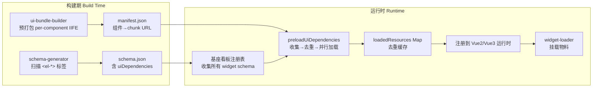
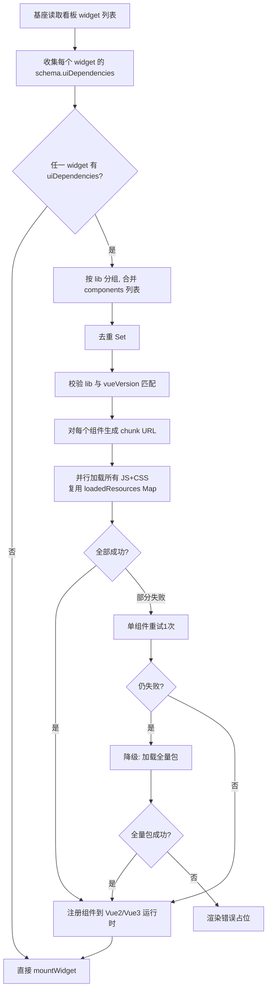

# ElementUI 注册表驱动按需加载方案设计

> 本文档是 [`elementui-migration-strategy.md`](./elementui-migration-strategy.md) 的补充与升级。
> 迁移策略文档中第 2.2 节「基座提供完整 ElementUI 全量包」的结论在生产环境已被本文的**注册表驱动按需加载**方案取代；全量加载仅作为降级兜底保留。

---

## 0. 执行摘要（Executive Summary）

本项目是 BI 看板微前端：基座（`vue2-host` / `vue3-host`）通过 `wc/widget-loader` 在运行时加载 Vue 2 / Vue 3 物料（widget）。物料统一使用 ElementUI（Vue 2 用 `element-ui`，Vue 3 用 `element-plus`）。

如果基座在首屏一次性加载完整 ElementUI，会带来明显的性能损失：

| 库 | 全量 JS（gzip） | 全量 CSS（未压缩） |
| --- | --- | --- |
| `element-ui@2.15.14` | **~198.6 kB** | 240 kB |
| `element-plus@2.7.0` | **~353.5 kB** | 320 kB |

而一个典型 BI 看板卡片往往只用到 5～10 个组件（Button / Input / Select / Table / Pagination / Dialog …）。按需加载可以把首屏 UI 库体积从「数百 kB」压缩到「数十 kB」，且多物料共享同一份组件缓存。

本文提出**注册表驱动的按需加载架构（Plan C）**：

1. `schema-generator` 在构建期扫描物料 `<template>` 中的 `<el-*>` 标签，自动写入 `schema.json` 的 `uiDependencies` 字段；
2. 基座在挂载物料前，解析注册表 → 收集所需组件 → 去重 → 并行加载 → 注册到对应 Vue 运行时 → 再挂载物料；
3. 组件 chunk 通过自建 per-component IIFE bundle + `manifest.json` 提供，复用 `widget-loader` 现有的 `loadedResources` Map 做去重缓存；
4. 单组件加载失败时降级到全量包，全量包仍失败则渲染错误占位。

**推荐结论**：生产环境采用 Plan C（注册表按需），Plan B（基座全量）作为降级兜底。详见 [第 7 节](#7-方案对比与推荐结论)。

---

## 0.1 已落地：运行时按需加载（前置依赖）

> 在按组件按需加载（Plan C）落地之前，`wc/loader.js` 已实现「运行时按需加载」：基座 `index.html` 不再首屏注入 Vue2 / Vue3 / element-ui / element-plus，而是由 `mountWidget` 在加载物料 UMD 之前，按物料的 `vueVersion` + `runtimeDeps` 声明补齐缺失的全局变量。

这是 ElementUI 按需加载的**前置条件**：先把整个 UI 库按物料声明懒加载（消除首屏体积），再在此基础上做按组件加载（进一步消除冗余）。本节描述已实现的部分，第 1 节起描述更精细的设计目标。

### API

```js
import { ensureRuntimes } from '@wc/core/loader';

// 通常由 mountWidget 内部自动调用；业务侧仅在需要预热时手动调用
await ensureRuntimes({ vue2: true, vue3: true, elementUi: true, elementPlus: true });
```

| 参数 | 类型 | 说明 |
|------|------|------|
| `needs.vue2` | boolean | 加载 `window.Vue2`（缺失时拉 `/runtime/vue2.js`） |
| `needs.vue3` | boolean | 加载 `window.Vue3`（缺失时拉 `/runtime/vue3.js`） |
| `needs.elementUi` | boolean | 加载 `window.ELEMENT`（自动先加载 vue2） |
| `needs.elementPlus` | boolean | 加载 `window.ElementPlus`（自动先加载 vue3） |

### 默认 URL 与覆盖

`loader.js` 内置默认 URL 表，业务侧可通过 `window.__WIDGET_RUNTIME_URLS__` 覆盖为自有 CDN：

```js
window.__WIDGET_RUNTIME_URLS__ = {
  'element-plus': {
    js: 'https://cdn.example.com/element-plus@2.7.0.js',
    css: 'https://cdn.example.com/element-plus@2.7.0.css',
    globalVar: 'ElementPlus',
    requires: 'vue3'
  }
};
```

### 物料侧声明

物料通过 `runtimeDeps` 声明运行时依赖，loader 据此决定是否加载 element-ui / element-plus：

```js
await mountWidget(container, {
  name: 'biFinancePanel',
  js: '/widgets/finance-panel.js',
  css: '/widgets/finance-panel.css',
  vueVersion: '3',
  runtimeDeps: ['element-plus'],  // loader 自动按需加载 element-plus（含前置 vue3）
  props: { title: '财务' }
});
```

### 与 Plan C 的关系

| 维度 | 当前已实现 | Plan C（待实施） |
|------|------------|------------------|
| 粒度 | 整包（element-ui / element-plus 全量） | 单组件（Button / Input / Select …） |
| 触发 | 物料声明 `runtimeDeps` | 物料 `schema.json` 声明 `uiDependencies.components` |
| 注册 | `Vue.use(window.ELEMENT)` | `Vue.component('el-button', Component)` |
| 体积 | 数百 kB（按物料懒加载） | 数十 kB（按物料实际使用的组件加载） |

> 运行时按需加载完成后，Plan C 的注册表驱动按组件加载可作为下一步优化目标。

---

## 1. 调研：ElementUI 包体积

### 1.1 全量包体积

数据来源：[unpkg](https://unpkg.com/) 文件列表 + [bundlephobia](https://bundlephobia.com/)。CSS 的 gzip 为按典型压缩比估算（CSS 通常压缩到原体积的 15%～20%）。

| 库 / 版本 | 全量 JS 路径 | JS 未压缩 | JS gzip | 全量 CSS 路径 | CSS 未压缩 | CSS gzip（估） |
| --- | --- | --- | --- | --- | --- | --- |
| `element-ui@2.15.14` | `lib/index.js` | 665 kB | **~198.6 kB** | `lib/theme-chalk/index.css` | 240 kB | ~38 kB |
| `element-plus@2.7.0` | `dist/index.full.min.js` | 958 kB | **~353.5 kB** | `dist/index.css` | 320 kB | ~50 kB |

> 说明：bundlephobia 测得 `element-ui@2.15.14` 为 777.3 kB（min）/ 198.6 kB（gzip），`element-plus@2.7.0` 为 1.3 MB（min）/ 353.5 kB（gzip）。该数值包含包内全部模块，与 `lib/index.js` / `dist/index.full.min.js` 的单文件体积略有差异，但 gzip 量级一致，可作为全量加载的参考。

### 1.2 单组件体积（element-ui@2.15.14）

`element-ui` 在 `lib/` 下为每个组件提供独立的 UMD 文件，在 `lib/theme-chalk/` 下提供独立 CSS。以下为常见组件的未压缩体积（来源：unpkg 目录列表）：

| 组件 | `lib/{name}.js` | `lib/theme-chalk/{name}.css` |
| --- | --- | --- |
| button | 10.3 kB | 10.4 kB |
| input | 29.2 kB | 6.68 kB |
| select | 63.4 kB | 19.0 kB |
| table | 149 kB | 23.4 kB |
| table-column | 28.7 kB | 13.1 kB |
| dialog | 15.5 kB | 2.64 kB |
| form | 13.8 kB | 2.65 kB |
| form-item | 23.3 kB | 0 B（合入 form） |
| pagination | 25.8 kB | 23.7 kB |
| date-picker | 194 kB | 28.7 kB |
| time-picker | 85.7 kB | 21.8 kB |
| cascader | 39.2 kB | 29.6 kB |
| tree | 64.2 kB | 12.9 kB |
| tabs | 28.1 kB | 16.5 kB |
| message-box | 33.4 kB | 21.6 kB |
| message | 15.2 kB | 1.95 kB |
| icon | 8.44 kB | 12.6 kB |
| base（基础样式） | — | 16.5 kB |

> 一个只用 `button / input / select / table / pagination / dialog` 的看板卡片，按需 JS 合计约 **294 kB（未压缩）**，相比全量 `lib/index.js` 的 665 kB 节省约 56%；多物料共享后边际成本接近 0。

### 1.3 单组件体积（element-plus@2.7.0）

`element-plus` 采用 ES Module 目录结构，每个组件位于 `es/components/{name}/`：

| 资源 | 路径 | 体积 |
| --- | --- | --- |
| 组件 JS 入口（re-export） | `es/components/button/index.mjs` | 556 B |
| 组件 JS 源码目录 | `es/components/button/src/` | 61 kB |
| 组件 style 入口 | `es/components/button/style/css.mjs` | 117 B |
| 组件 CSS | `theme-chalk/el-button.css` | 由 style 入口间接引入 |
| 全量 CSS | `dist/index.css` | 320 kB |

`es/components/button/style/css.mjs` 的实际内容（来自 unpkg）：

```js
import '../../base/style/css.mjs';
import 'element-plus/theme-chalk/el-button.css';
```

`es/components/button/index.mjs` 的实际内容：

```js
import '../../utils/index.mjs';
import Button from './src/button2.mjs';
import ButtonGroup from './src/button-group2.mjs';
// ...
export { ElButton, ElButtonGroup };
```

> **关键发现**：`element-plus` 的 per-component 产物是 **ESM 且含裸导入**（`../../utils/index.mjs`、`element-plus/theme-chalk/el-button.css`），**不能直接通过浏览器 `<script src>` 加载**，必须经打包器处理，或由基座自建 per-component IIFE/UMD bundle。`dist/` 目录只提供全量 UMD（`index.full.min.js`），**没有 per-component UMD**。

---

## 2. 调研：按组件引入可行性

### 2.1 element-ui（Vue 2）

- **官方支持按组件引入 JS**：`import { Button, Input } from 'element-ui'` 配合 [`babel-plugin-component`](https://github.com/ElementUI/babel-plugin-component) 会被转换为 `import Button from 'element-ui/lib/button'`。
- 也可直接：`import Button from 'element-ui/lib/button'`。
- **CSS**：`import 'element-ui/lib/theme-chalk/button.css'`（或通过 `babel-plugin-component` 的 `styleLibraryName: 'theme-chalk'` 自动注入）。
- `lib/{name}.js` 是 **UMD 格式**，依赖全局 `Vue`，可通过 `<script>` 标签直接加载并挂到 `window`。

### 2.2 element-plus（Vue 3）

- **官方支持按组件引入**：`import { ElButton } from 'element-plus'`（基于 ESM 的 Tree Shaking），或直接 `import ElButton from 'element-plus/es/components/button'`。
- **CSS**：`import 'element-plus/es/components/button/style/css'`（由 [`unplugin-element-plus`](https://www.npmjs.com/package/unplugin-element-plus) 自动注入），等价于 `import 'element-plus/theme-chalk/el-button.css'`。
- **运行时直接加载受限**：`es/components/*` 是 ESM 且含裸导入，浏览器原生 `<script type="module">` 需配合 import map 才能解析 `element-plus/theme-chalk/...` 这类包名导入；`<script src>` 完全不可用。

### 2.3 CDN 是否提供 per-component 资源

| 库 | per-component JS | per-component CSS | 可直接 `<script>`/`<link>` 加载？ |
| --- | --- | --- | --- |
| `element-ui` | `https://unpkg.com/element-ui@2.15.14/lib/button.js` | `https://unpkg.com/element-ui@2.15.14/lib/theme-chalk/button.css` | ✅ JS 为 UMD（依赖全局 Vue），CSS 直接可用 |
| `element-plus` | `https://unpkg.com/element-plus@2.7.0/es/components/button/index.mjs` | `https://unpkg.com/element-plus@2.7.0/theme-chalk/el-button.css` | ⚠️ JS 为 ESM 含裸导入，需 import map；CSS 直接可用 |

> 结论：`element-ui` 可直接走 CDN per-component；`element-plus` 的 per-component JS 必须由基座自建 IIFE/UMD bundle（或采用 import map 方案，见 [第 4.3 节](#43-两种-chunk-提供策略)）。

### 2.4 unplugin 系列工具机制

以下工具均为**构建期（compile-time）**转换，不参与运行时按需加载：

| 工具 | 作用 | 转换示例 |
| --- | --- | --- |
| [`unplugin-vue-components`](https://github.com/unplugin/unplugin-vue-components) + `ElementPlusResolver` | 扫描模板 `<el-*>` 标签，自动 `import { ElButton } from 'element-plus/es/components/button'` 并注入 style | `<el-button>` → 自动 import + `import 'element-plus/es/components/button/style/css'` |
| [`unplugin-auto-import`](https://github.com/unplugin/unplugin-auto-import) | 自动导入 `ElMessage` / `ElMessageBox` / `ElNotification` / `ElLoading` 等 API | 源码直接用 `ElMessage(...)` → 自动 import |
| [`unplugin-element-plus`](https://www.npmjs.com/package/unplugin-element-plus) | 把 `import { ElButton } from 'element-plus'` 重写为按组件路径 + style import | `import { ElButton } from 'element-plus'` → 增加 `import 'element-plus/es/components/button/style/css'` |

> **关键结论**：unplugin 系列是「物料构建期」工具，无法解决「基座在运行时为多个已构建好的物料共享加载 UI 组件」的问题。这正是注册表驱动方案（Plan C）需要存在的原因——它把「物料用了哪些组件」这一信息通过 `schema.json` 沉淀下来，供基座运行时消费。

---

## 3. 架构设计总览



核心思路：**把「物料用了哪些 UI 组件」从运行时推断（不可靠）前移到构建期静态扫描（可靠），通过 `schema.json` 传递给基座，基座据此做精准的运行时按需加载。**

---

## 4. 架构设计细节

### 4.1 `uiDependencies` 字段格式

在 `schema.json` 顶层新增 `uiDependencies` 字段，描述该物料对 ElementUI 的依赖。组件名统一使用**去掉 `el-` 前缀的 kebab-case**（如 `button`、`form-item`、`date-picker`），由基座按 `lib` 类型映射到实际 chunk 路径。

#### 字段定义

| 字段 | 类型 | 必填 | 说明 |
| --- | --- | --- | --- |
| `lib` | `"element-ui" \| "element-plus"` | 是 | UI 库类型，必须与物料 `vueVersion` 匹配（Vue 2 → `element-ui`，Vue 3 → `element-plus`） |
| `version` | `string`（semver range） | 是 | 兼容版本范围，如 `"^2.15.0"` / `"^2.7.0"`，供 `widget-loader` 校验 |
| `components` | `string[]` | 是 | 去前缀的组件名列表，如 `["button", "input", "select"]` |
| `styles` | `string[]` | 否 | 额外需要的基础样式，如 `["base", "icon"]`；默认包含 `base` |
| `full` | `boolean` | 否 | `true` 时基座直接加载全量包（用于降级或物料用了极多组件）。默认 `false` |

#### Vue 2 物料示例（element-ui）

```json
{
  "name": "bi-sales-panel",
  "uiDependencies": {
    "lib": "element-ui",
    "version": "^2.15.0",
    "components": ["button", "input", "select", "table", "table-column", "pagination", "form", "form-item", "dialog", "icon"],
    "styles": ["base", "icon"]
  }
}
```

#### Vue 3 物料示例（element-plus）

```json
{
  "name": "bi-finance-panel",
  "uiDependencies": {
    "lib": "element-plus",
    "version": "^2.7.0",
    "components": ["button", "input", "select", "table", "pagination", "form", "form-item", "dialog", "icon", "message", "message-box"],
    "styles": ["base"]
  }
}
```

#### 降级 / 兜底示例

```json
{
  "name": "bi-legacy-mixed",
  "uiDependencies": {
    "lib": "element-plus",
    "version": "^2.7.0",
    "full": true
  }
}
```

> 物料若不依赖 ElementUI（不依赖 ElementUI 或无 UI 库），则**不写** `uiDependencies` 字段，基座跳过预加载。

### 4.2 基座预加载流程

基座在挂载一批物料前，先执行 `preloadUiDependencies(widgets)`，完成后再逐个 `mountWidget`。



#### 流程要点

1. **解析注册表**：基座看板配置中每个 widget 关联一个 `schema.json`（已由 `schema-generator` 生成并随物料产物发布）。基座读取其中的 `uiDependencies`。
2. **收集 + 去重**：按 `lib`（`element-ui` / `element-plus`）分组，合并所有物料的 `components` 到一个 `Set`，避免多物料重复加载同一组件。
3. **版本与类型校验**：`widget-loader.checkDependencies` 扩展校验 `uiDependencies.lib` 与 `widget.vueVersion` 是否匹配（Vue 3 物料不能用 `element-ui`），并校验 `version` 落在 `SUPPORTED_DEPS` 兼容范围。
4. **并行加载**：对去重后的每个组件生成 JS + CSS 两个 URL，用 `Promise.all` 并行加载；每个 URL 复用 `loadedResources` Map，同一组件只发一次请求。
5. **注册到运行时**：
   - Vue 2：`Vue.use(Component)` 或 `Vue.component('el-button', Component)`；
   - Vue 3：`app.component('el-button', Component)`（基座 `vue3-host` 的 app 实例）。
6. **挂载物料**：UI 组件注册完成后，再调用 `mountWidget`，物料模板中的 `<el-*>` 即可正常解析。

### 4.3 两种 chunk 提供策略

由于 `element-plus` 无 per-component UMD，需在「自建 bundle」与「import map」之间二选一。

#### 策略 A（推荐）：自建 per-component IIFE/UMD bundle

基座新增一个构建脚本 `wc/ui-bundle-builder`，在 CI 中把 `element-ui` / `element-plus` 每个组件预打包成自包含的 IIFE 单文件，发布到自有 CDN，并生成 `manifest.json`。

**优点**：统一版本/主题/压缩；`element-plus` 的裸导入在构建期被解析内联；运行时用最简单的 `<script>` 加载，与现有 `widget-loader.loadScript` 完全兼容；可做 tree-shaking 与按需 polyfill。

**产物结构**：

```text
https://cdn.example.com/ui/
├── element-ui@2.15.14/
│   ├── manifest.json
│   ├── base.css
│   ├── button.js        # IIFE: window.__UI__['element-ui'].button = Component
│   ├── button.css
│   ├── input.js
│   ├── input.css
│   └── ...
└── element-plus@2.7.0/
    ├── manifest.json
    ├── base.css
    ├── button.js        # IIFE: window.__UI__['element-plus'].button = Component
    ├── button.css
    └── ...
```

#### 策略 B（备选）：import map + 原生 ESM

对 `element-plus` 使用浏览器 import map 把 `element-plus/...` 与 `vue` 映射到 CDN，再用 `<script type="module" src=".../es/components/button/index.mjs">` 加载。

**缺点**：需为每个组件动态扩展 import map；`element-ui` 的 UMD 与 ESM 混用复杂；兼容性与缓存控制不如自建 bundle 直观。本文**不推荐**作为主方案，仅在不愿自建 bundle 时作为退路。

### 4.4 组件 chunk URL 规范

采用策略 A 时，URL 约定如下（`{CDN_BASE}` 为基座配置的 CDN 域名）：

```text
JS:  {CDN_BASE}/ui/{lib}@{version}/{component}.js
CSS: {CDN_BASE}/ui/{lib}@{version}/{component}.css
基础样式: {CDN_BASE}/ui/{lib}@{version}/base.css
清单: {CDN_BASE}/ui/{lib}@{version}/manifest.json
全量降级 JS: {CDN_BASE}/ui/{lib}@{version}/full.js
全量降级 CSS: {CDN_BASE}/ui/{lib}@{version}/full.css
```

示例：

```text
https://cdn.example.com/ui/element-plus@2.7.0/button.js
https://cdn.example.com/ui/element-plus@2.7.0/button.css
https://cdn.example.com/ui/element-ui@2.15.14/date-picker.js
```

`manifest.json` 示例：

```json
{
  "lib": "element-plus",
  "version": "2.7.0",
  "globalVar": "__UI_ELEMENT_PLUS__",
  "baseCss": "base.css",
  "fullJs": "full.js",
  "fullCss": "full.css",
  "components": {
    "button": { "js": "button.js", "css": "button.css", "depends": [] },
    "form-item": { "js": "form-item.js", "css": "form-item.css", "depends": ["form"] },
    "table-column": { "js": "table-column.js", "css": "table-column.css", "depends": ["table"] },
    "option": { "js": "option.js", "css": "option.css", "depends": ["select"] }
  }
}
```

> `depends` 描述组件间的隐式依赖（如 `form-item` 依赖 `form`），基座预加载时自动补齐，避免物料只声明了 `form-item` 却漏掉 `form`。

IIFE bundle 的全局挂载约定：每个 `{component}.js` 执行后把组件挂到 `window.__UI_ELEMENT_PLUS__['button']`（element-ui 挂到 `window.__UI_ELEMENT_UI__['button']`），基座读取后注册。

### 4.5 缓存策略

复用 `wc/widget-loader/index.js` 既有的 `loadedResources` Map 模式（见 `widget-loader` 第 13 行 `const loadedResources = new Map()` 与 `loadScript` / `loadStyle` 的去重逻辑），UI 资源使用同一套机制：

```js
// 复用 widget-loader 已有的 loadedResources Map，UI 资源与物料资源共享去重池
// 关键不变量：同一 URL 的 Promise 只创建一次，多 widget 并发请求同一组件共享同一个 Promise
function loadUiResource(url, type) {
  if (loadedResources.has(url)) return loadedResources.get(url); // 命中缓存
  const p = type === 'css' ? loadStyle(url) : loadScript(url);
  loadedResources.set(url, p);
  // loadScript/loadStyle 内部失败时已 delete(url)，允许后续重试
  return p;
}
```

缓存层次：

| 层次 | 机制 | 作用范围 |
| --- | --- | --- |
| 内存去重 | `loadedResources` Map（URL → Promise） | 同一页面会话内，多物料共享，绝不重复请求 |
| 失败可重试 | 加载失败时 `delete(url)`（`widget-loader` 既有行为） | 单组件失败不影响其他组件，重试可重新发请求 |
| HTTP 缓存 | URL 含 `lib@version`，配 `Cache-Control: immutable` | 跨页面会话，版本不变时走浏览器磁盘缓存 |
| 版本隔离 | 不同 `version` 走不同目录 | 升级 UI 库时天然 bust 缓存 |

### 4.6 降级方案

降级按「单组件 → 全量包 → 占位」三级链路：

| 场景 | 触发条件 | 处理 |
| --- | --- | --- |
| 单组件加载失败 | 某 `{component}.js` / `.css` 加载超时或 404 | 重试 1 次；仍失败则该组件标记为缺失，继续加载其他组件 |
| 缺失组件数超阈值 | 缺失组件占比 > 30%（可配置） | 触发全量包降级：加载 `full.js` + `full.css` |
| `uiDependencies.full === true` | 物料显式声明全量 | 直接加载全量包，跳过 per-component |
| 全量包也失败 | `full.js` 加载失败 | 渲染错误占位（复用 `widget-loader.renderFallback`），提示「UI 依赖加载失败」并提供重试 |
| `uiDependencies` 缺失 | 物料未声明 UI 依赖 | 跳过预加载，按原流程挂载（兼容无 ElementUI / 无 UI 库物料） |
| `lib` 与 `vueVersion` 不匹配 | 如 `vueVersion: '3'` 但 `lib: 'element-ui'` | `checkDependencies` 报 `DEP_VERSION_MISMATCH`，拒绝加载并渲染占位（无重试按钮） |
| 缺失依赖告警 | 物料模板用了 `<el-xxx>` 但 `uiDependencies.components` 未声明 | 控制台 `console.warn` + 埋点，开发环境高亮缺失组件 |

> 缺失依赖告警依赖 `schema-generator` 的扫描准确性（见 [第 8.1 节](#81-schema-generator-提取-el--标签)）。若扫描遗漏，物料运行时会出现「未注册组件」警告，告警机制可帮助快速定位。

---

## 5. 基座预加载流程图（详细）

```text
┌─────────────────────────────────────────────────────────────────┐
│  基座启动                                                        │
│  vue2-host: window.Vue2 / window.__UI_ELEMENT_UI__ = {}          │
│  vue3-host: window.Vue3 / window.__UI_ELEMENT_PLUS__ = {}        │
└───────────────────────────┬─────────────────────────────────────┘
                            │
                            ▼
┌─────────────────────────────────────────────────────────────────┐
│  读取看板配置 → widgets[] (每个含 name/js/css/vueVersion/schema) │
└───────────────────────────┬─────────────────────────────────────┘
                            │
                            ▼
┌─────────────────────────────────────────────────────────────────┐
│  preloadUiDependencies(widgets)                                  │
│  1. 收集 widgets[*].schema.uiDependencies                        │
│  2. 按 lib 分组 → { element-ui: Set, element-plus: Set }         │
│  3. 校验 lib↔vueVersion 匹配 + version 范围                       │
│  4. 拉 manifest.json（首次）→ 补齐 depends 隐式依赖               │
│  5. 生成 URL 列表：base.css + 每个 component 的 .js/.css          │
│  6. Promise.all 并行加载（loadedResources Map 去重）              │
│  7. 失败组件重试 1 次 → 超阈值则降级 full.js/full.css             │
│  8. 注册：Vue2 → Vue.component / Vue3 → app.component             │
└───────────────────────────┬─────────────────────────────────────┘
                            │
                            ▼
┌─────────────────────────────────────────────────────────────────┐
│  逐个 mountWidget(container, widget)                             │
│  物料模板 <el-button> 等已可解析                                  │
└─────────────────────────────────────────────────────────────────┘
```

---

## 6. 与现有 widget-loader 的集成点

本方案不重写 `widget-loader`，而是复用其既有能力并最小化扩展：

| 现有能力（`wc/widget-loader/index.js`） | 复用方式 |
| --- | --- |
| `loadedResources` Map（第 13 行） | UI 资源与物料资源共享同一去重池 |
| `loadScript(url, timeout)` / `loadStyle(url, timeout)`（第 151/198 行） | 直接用于加载 UI chunk，复用超时清理逻辑 |
| `SUPPORTED_DEPS` + `satisfies()` + `checkDependencies()`（第 18/43/91 行） | 扩展增加 `elementUi` / `elementPlus` 条目与 `uiDependencies` 校验 |
| `renderFallback(container, message, widget, onRetry)`（第 413 行） | UI 依赖加载失败时复用降级占位 |
| `mountWidget` 流程 | 在其内部 `checkDependencies` 之后、`loadScript(js)` 之前插入 `preloadUiDependencies` |

> 详见 [第 8.2 节](#82-widget-loader-预加载逻辑) 的代码示例。

---

## 7. 方案对比与推荐结论

### 7.1 四方案对比

评分维度（1～5 分，**5 分最优**；「复杂度」5 分表示最简单/成本最低）：

| 方案 | 性能 | 复杂度 | 可维护性 | 兼容性 | 总分 |
| --- | --- | --- | --- | --- | --- |
| **A** 物料侧按需（`babel-plugin-component` / `unplugin-vue-components` 在每个 widget 构建） | 2 | 4 | 2 | 3 | **11** |
| **B** 基座全量 + 物料 externalize | 3 | 5 | 4 | 5 | **17** |
| **C** 注册表驱动按需（基座预加载） | 5 | 3 | 4 | 4 | **16** |
| **D** unplugin-auto-import 主机级自动检测 | 4 | 2 | 3 | 3 | **12** |

#### 方案 A：物料侧按需

- **性能 2**：每个 widget 独立打包所用组件，同页多 widget 时 Button/Input/CSS 重复打包多次，总包体积随物料数线性膨胀。
- **复杂度 4**：每个 widget 配置 `babel-plugin-component` / `unplugin-vue-components`，单物料改造成本低。
- **可维护性 2**：各 widget 可能引入不同版本/主题，难以统一；与基座「公共依赖由基座托管」的契约冲突。
- **兼容性 3**：与现有 `widget-loader` 的 `SUPPORTED_DEPS` external 模型相悖。

#### 方案 B：基座全量 + 物料 externalize

- **性能 3**：首屏必须加载全量包（element-plus ~353.5 kB gzip JS + ~50 kB CSS），即便物料只用 3 个组件。
- **复杂度 5**：最简单，基座 `app.use(ElementPlus)` 一次搞定。
- **可维护性 4**：版本/主题统一，但所有物料锁同一版本。
- **兼容性 5**：与现有 external 契约完全契合。

#### 方案 C：注册表驱动按需（推荐）

- **性能 5**：只加载用到的组件，多物料共享缓存；典型看板首屏 UI 体积可从 ~350 kB 降至 ~60～100 kB。
- **复杂度 3**：需新增 `schema-generator` 扫描、`ui-bundle-builder` 预打包、`widget-loader` 预加载流程。
- **可维护性 4**：`uiDependencies` 由构建期自动生成，无需人工维护；版本由 `manifest.json` 统一。
- **兼容性 4**：需自建 per-component bundle（因 element-plus 无 per-component UMD），但与现有 `loadedResources` / `checkDependencies` 模型兼容。

#### 方案 D：unplugin-auto-import 主机级自动检测

- **性能 4**：理论上可按需，但主机需在运行时扫描已构建物料的源码/AST 来判断用了哪些组件，不可靠。
- **复杂度 2**：unplugin 是构建期工具，无法在主机运行时对「已构建好的 UMD 物料」做自动检测；强行实现需反编译产物，成本极高。
- **可维护性 3**：自动检测结果不可控，易漏检/误检。
- **兼容性 3**：与物料已 externalize 的产物模型不匹配。

### 7.2 推荐结论

**生产环境采用 Plan C（注册表驱动按需），Plan B（基座全量）作为降级兜底。**

理由：

1. 本项目首要目标是**最大化页面性能**，Plan C 在多物料看板场景下首屏 UI 体积可比 Plan B 减少 60%～80%；
2. Plan C 把「物料用了哪些组件」沉淀到 `schema.json`，由 `schema-generator` 构建期自动生成，可维护性接近 Plan B；
3. Plan C 复用 `widget-loader` 既有的 `loadedResources` / `checkDependencies` / `renderFallback` 模型，改动可控；
4. Plan D 在运行时主机级自动检测技术上不可行（unplugin 是构建期工具），Plan A 与基座托管契约冲突，均不采纳。

### 7.3 实施路线图

| 阶段 | 内容 | 产出 | 里程碑 |
| --- | --- | --- | --- |
| **Phase 1** | 扩展 `wc/schema-generator`：扫描 `<template>` 中 `<el-*>` 标签，写入 `schema.json` 的 `uiDependencies` | `schema-generator` 升级 | 物料 schema 自动含 UI 依赖 |
| **Phase 2** | 新增 `wc/ui-bundle-builder`：CI 中把 element-ui / element-plus 每组件预打包成 IIFE + 生成 `manifest.json`，发布到 CDN | `manifest.json` + per-component chunk | CDN 可按组件加载 |
| **Phase 3** | 扩展 `wc/widget-loader`：新增 `preloadUiDependencies`，扩展 `SUPPORTED_DEPS` 与 `checkDependencies` | loader 支持 UI 预加载 | 基座可按需加载 UI |
| **Phase 4** | 实现降级链路：单组件失败重试 → 全量包降级 → 错误占位；缺失依赖告警 | 降级与告警机制 | 容错达标 |
| **Phase 5** | 灰度迁移：先 1 个 Vue 3 物料验证，再扩展到同类物料；监控首屏 LCP / JS 执行时间 | 灰度报告 + 性能对比 | 全量上线 |

> Phase 1～3 可并行启动：Phase 1 改 schema 生成器，Phase 2 改构建产物，Phase 3 改 loader，三者通过 `uiDependencies` 字段与 `manifest.json` 解耦。

---

## 8. 代码示例

> 以下代码仅为设计示例，**不在本任务中落地到源码**，供后续实施阶段参考。

### 8.1 schema-generator 提取 `<el-*>` 标签

在 `wc/schema-generator/index.js` 的 `generateSchema` 中扩展，扫描 `<template>` 收集 `el-` 前缀组件，并结合物料 Vue 版本推断 `lib`。

```js
// wc/schema-generator/index.js（设计示例，扩展 generateSchema）

// 已知的 element-ui / element-plus 组件名（去 el- 前缀的 kebab-case）
// 实际可从 element-ui/lib 与 element-plus/es/components 目录动态读取
const ELEMENT_COMPONENTS = new Set([
  'button', 'input', 'input-number', 'select', 'option', 'option-group',
  'radio', 'radio-group', 'radio-button', 'checkbox', 'checkbox-group', 'checkbox-button',
  'switch', 'slider', 'date-picker', 'time-picker', 'time-select', 'color-picker',
  'cascader', 'cascader-panel', 'transfer', 'table', 'table-column', 'pagination',
  'tag', 'badge', 'avatar', 'card', 'carousel', 'carousel-item', 'collapse',
  'collapse-item', 'timeline', 'timeline-item', 'divider', 'backtop', 'drawer',
  'dialog', 'tooltip', 'popover', 'popconfirm', 'dropdown', 'dropdown-item',
  'dropdown-menu', 'menu', 'submenu', 'menu-item', 'menu-item-group', 'tabs',
  'tab-pane', 'breadcrumb', 'breadcrumb-item', 'steps', 'step', 'alert', 'message',
  'message-box', 'notification', 'loading', 'form', 'form-item', 'tree', 'upload',
  'progress', 'rate', 'spinner', 'skeleton', 'skeleton-item', 'empty', 'result',
  'descriptions', 'descriptions-item', 'image', 'container', 'header', 'aside',
  'main', 'footer', 'row', 'col', 'link', 'icon', 'calendar', 'scrollbar',
  'infinite-scroll', 'page-header', 'statistic', 'affix', 'autocomplete'
]);

/**
 * 从 <template> 中提取 <el-xxx> 标签，返回去前缀的组件名集合。
 * 仅匹配 ELEMENT_COMPONENTS 中已知的组件，避免误收集业务自定义标签。
 */
function extractElementComponents(templateSource) {
  const found = new Set();
  // 匹配 <el-button ...> 或 <el-form-item ...>，支持自闭合与换行
  const tagRe = /<el-([a-z][a-z0-9-]*)\b/g;
  let m;
  while ((m = tagRe.exec(templateSource)) !== null) {
    const name = m[1];
    if (ELEMENT_COMPONENTS.has(name)) found.add(name);
  }
  return [...found];
}

/**
 * 根据物料 Vue 版本推断 UI 库类型与兼容范围。
 * options.vueVersion 由 widget-wrapper-plugin 传入（'2' | '3'）。
 */
function inferUiLib(vueVersion) {
  if (vueVersion === '3') {
    return { lib: 'element-plus', version: '^2.7.0' };
  }
  return { lib: 'element-ui', version: '^2.15.0' };
}

// 在 generateSchema 中调用：
// const template = source.match(/<template[^>]*>([\s\S]*?)<\/template>/)?.[1] || '';
// const components = extractElementComponents(template);
// if (components.length) {
//   const { lib, version } = inferUiLib(options.vueVersion);
//   schema.uiDependencies = { lib, version, components, styles: ['base'] };
// }
```

生成的 `schema.json` 片段：

```json
{
  "name": "bi-finance-panel",
  "uiDependencies": {
    "lib": "element-plus",
    "version": "^2.7.0",
    "components": ["button", "input", "select", "table", "pagination", "form", "form-item", "dialog", "icon"],
    "styles": ["base"]
  }
}
```

### 8.2 widget-loader 预加载逻辑

在 `wc/widget-loader/index.js` 中新增 `preloadUiDependencies`，并扩展 `SUPPORTED_DEPS`。

```js
// wc/widget-loader/index.js（设计示例）

// 扩展 SUPPORTED_DEPS（在现有 vue2/vue3 基础上新增）
const SUPPORTED_DEPS = {
  vue2:        { version: '2.6.14',  compatibleRange: '^2.6.0',  globalVar: 'Vue2' },
  vue3:        { version: '3.4.21',  compatibleRange: '^3.0.0',  globalVar: 'Vue3' },
  elementUi:   { version: '2.15.14', compatibleRange: '^2.15.0', globalVar: '__UI_ELEMENT_UI__'    },
  elementPlus: { version: '2.7.0',   compatibleRange: '^2.7.0',  globalVar: '__UI_ELEMENT_PLUS__'  }
};

// CDN 基址，由基座配置注入
const UI_CDN_BASE = (typeof window !== 'undefined' && window.__UI_CDN_BASE__) || 'https://cdn.example.com/ui';

// manifest 缓存：lib@version -> Promise<manifest>
const manifestCache = new Map();

async function fetchManifest(lib, version) {
  const key = `${lib}@${version}`;
  if (manifestCache.has(key)) return manifestCache.get(key);
  const url = `${UI_CDN_BASE}/${key}/manifest.json`;
  const p = fetch(url).then(r => {
    if (!r.ok) throw new Error(`Failed to load UI manifest: ${url}`);
    return r.json();
  });
  manifestCache.set(key, p);
  return p;
}

/**
 * 收集多个物料的 UI 依赖，按 lib 分组去重。
 * @param {Array<Object>} widgets
 * @returns {Object} { 'element-ui': Set, 'element-plus': Set, fullFlags: Set }
 */
function collectUiDeps(widgets) {
  const grouped = { 'element-ui': new Set(), 'element-plus': new Set() };
  const fullFlags = { 'element-ui': false, 'element-plus': false };
  for (const w of widgets) {
    const ui = w.schema?.uiDependencies || w.uiDependencies;
    if (!ui || !ui.lib) continue;
    if (ui.full) { fullFlags[ui.lib] = true; continue; }
    if (Array.isArray(ui.components)) {
      ui.components.forEach(c => grouped[ui.lib].add(c));
    }
  }
  return { grouped, fullFlags };
}

/**
 * 把组件名转为 PascalCase 注册名，如 'form-item' -> 'ElFormItem'
 */
function toRegisterName(component) {
  return 'El' + component.split('-').map(s => s[0].toUpperCase() + s.slice(1)).join('');
}

/**
 * 预加载 UI 依赖并注册到对应 Vue 运行时。
 * 在 mountWidget 之前调用。
 */
export async function preloadUiDependencies(widgets) {
  const { grouped, fullFlags } = collectUiDeps(widgets);
  const tasks = [];

  for (const lib of ['element-ui', 'element-plus']) {
    const components = grouped[lib];
    if (components.size === 0 && !fullFlags[lib]) continue;

    const version = SUPPORTED_DEPS[lib === 'element-ui' ? 'elementUi' : 'elementPlus'].version;
    const globalVar = SUPPORTED_DEPS[lib === 'element-ui' ? 'elementUi' : 'elementPlus'].globalVar;
    const base = `${UI_CDN_BASE}/${lib}@${version}`;

    // 全量降级
    if (fullFlags[lib] || components.size === 0) {
      tasks.push(loadUiAndRegister(lib, globalVar, base, null, null));
      continue;
    }

    tasks.push(
      fetchManifest(lib, version).then(async manifest => {
        // 补齐 depends 隐式依赖
        const need = new Set(components);
        for (const c of components) {
          (manifest.components[c]?.depends || []).forEach(d => need.add(d));
        }
        // 加载 base.css + 每个组件的 js/css
        const loadTasks = [loadUiResource(`${base}/${manifest.baseCss || 'base.css'}`, 'css')];
        for (const c of need) {
          const meta = manifest.components[c];
          if (!meta) {
            console.warn(`[widget-loader] UI component "${c}" not in manifest, fallback to full`);
            return loadUiAndRegister(lib, globalVar, base, null, null);
          }
          loadTasks.push(loadUiResource(`${base}/${meta.js}`, 'js'));
          if (meta.css) loadTasks.push(loadUiResource(`${base}/${meta.css}`, 'css'));
        }
        await Promise.all(loadTasks);
        // 注册到对应 Vue 运行时
        registerComponents(lib, globalVar, need);
      }).catch(err => {
        // manifest 或单组件失败 → 降级全量
        console.warn(`[widget-loader] preload UI ${lib} failed, fallback to full:`, err);
        return loadUiAndRegister(lib, globalVar, base, null, null);
      })
    );
  }

  await Promise.all(tasks);
}

// 复用 widget-loader 既有的 loadedResources Map 与 loadScript/loadStyle
function loadUiResource(url, type) {
  if (loadedResources.has(url)) return loadedResources.get(url);
  const p = type === 'css' ? loadStyle(url) : loadScript(url);
  loadedResources.set(url, p);
  return p;
}

// 全量降级：加载 full.js + full.css，调用库自身的 install
async function loadUiAndRegister(lib, globalVar, base, _js, _css) {
  await Promise.all([
    loadUiResource(`${base}/full.js`, 'js'),
    loadUiResource(`${base}/full.css`, 'css')
  ]);
  // full.js 执行后会把整个库挂到 window[globalVar].$default 或类似位置
  // 由 ui-bundle-builder 约定，这里调用其 install
  const libObj = window[globalVar];
  if (lib && libObj) {
    installLib(lib, libObj);
  }
}

// 把 per-component bundle 挂载的组件注册到 Vue 运行时
function registerComponents(lib, globalVar, components) {
  const store = window[globalVar] || {};
  if (lib === 'element-ui') {
    const Vue = window.Vue2;
    if (!Vue) return;
    for (const c of components) {
      const comp = store[c];
      if (comp) Vue.component(toRegisterName(c), comp);
    }
  } else {
    const app = window.Vue3; // vue3-host 暴露的 app 实例（按现有约定）
    if (!app || !app.component) return;
    for (const c of components) {
      const comp = store[c];
      if (comp) app.component(toRegisterName(c), comp);
    }
  }
}

function installLib(lib, libObj) {
  if (lib === 'element-ui') {
    window.Vue2 && window.Vue2.use(libObj.$default || libObj);
  } else {
    const app = window.Vue3;
    app && app.use(libObj.$default || libObj);
  }
}
```

在 `mountWidget` / `loadWidget` 流程中插入预加载（设计示例）：

```js
// 批量挂载入口前先预加载 UI 依赖
export async function mountWidgets(container, widgets) {
  await preloadUiDependencies(widgets); // 先把 UI 组件注册好
  for (const w of widgets) {
    await mountWidget(container, w);    // 再逐个挂载物料
  }
}
```

---

## 9. 风险与注意事项

### 9.1 element-plus per-component bundle 的正确性

- **风险**：自建 IIFE bundle 时若漏打组件内部依赖（如 `el-select` 依赖 `el-tooltip` / `el-tag`），运行时会报「未注册组件」。
- **对策**：`ui-bundle-builder` 用 rollup 打包时开启 `inlineDynamicImports` 并把组件内部 import 全部内联；`manifest.json` 的 `depends` 字段由构建脚本扫描组件源码 import 关系自动生成；CI 增加冒烟测试，对每个组件单独加载并渲染。

### 9.2 全局变量命名冲突

- **风险**：`window.__UI_ELEMENT_UI__` / `window.__UI_ELEMENT_PLUS__` 需与 `widget-loader` 既有的 `window.ElementUI` / `window.ElementPlus`（迁移策略文档第 4 节）协调，避免两套全局变量混淆。
- **对策**：统一约定——按需加载走 `window.__UI_ELEMENT_*__`（per-component store），全量降级走 `window.ElementUI` / `window.ElementPlus`；`widget-loader` 优先读 per-component store，缺失时回退全量全局变量。

### 9.3 主题与样式一致性

- **风险**：自建 bundle 的 CSS 必须与基座主题变量一致，否则物料样式错乱。
- **对策**：`ui-bundle-builder` 构建时统一注入基座 SCSS 变量；`base.css` 由基座统一加载一次，所有组件 CSS 依赖之。

### 9.4 schema-generator 扫描遗漏

- **风险**：动态组件 `<component :is="'el-button'">`、字符串渲染、`h('el-button')` 等写法无法被正则扫描到。
- **对策**：缺失依赖告警（控制台 + 埋点）兜底；允许物料在 `schema.json` 中手动补全 `uiDependencies.components`；提供 lint 规则禁止动态渲染 element 组件。

### 9.5 版本锁定

- **风险**：`manifest.json` 的 `version` 必须与 `SUPPORTED_DEPS` 一致，否则 chunk URL 404。
- **对策**：`checkDependencies` 校验 `uiDependencies.version` 落在 `SUPPORTED_DEPS` 兼容范围；CI 校验 CDN 上 `manifest.json` 的 `version` 与基座 `SUPPORTED_DEPS` 一致。

---

## 10. 附录

### 10.1 关键文件清单（实施阶段参考）

| 文件路径 | 改动说明 |
| --- | --- |
| `/workspace/wc/schema-generator/index.js` | 扩展 `generateSchema`，扫描 `<el-*>` 写入 `uiDependencies` |
| `/workspace/wc/ui-bundle-builder/index.js`（新增） | CI 中预打包 per-component IIFE + 生成 `manifest.json` |
| `/workspace/wc/widget-loader/index.js` | 新增 `preloadUiDependencies`，扩展 `SUPPORTED_DEPS` 与 `checkDependencies` |
| `/workspace/docs/elementui-migration-strategy.md` | 引用本文，标注全量加载结论被按需加载取代 |

### 10.2 调研数据来源

- [unpkg: element-ui@2.15.14/lib 目录](https://unpkg.com/browse/element-ui@2.15.14/lib/)
- [unpkg: element-ui@2.15.14/lib/theme-chalk 目录](https://unpkg.com/browse/element-ui@2.15.14/lib/theme-chalk/)
- [unpkg: element-plus@2.7.0/es/components/button 目录](https://unpkg.com/browse/element-plus@2.7.0/es/components/button/)
- [unpkg: element-plus@2.7.0/dist 目录](https://unpkg.com/browse/element-plus@2.7.0/dist/)
- [bundlephobia: element-ui@2.15.14](https://bundlephobia.com/package/element-ui@2.15.14)
- [bundlephobia: element-plus@2.7.0](https://bundlephobia.com/package/element-plus@2.7.0)
- [unplugin-element-plus (npm)](https://www.npmjs.com/package/unplugin-element-plus)
- [Element Plus 快速开始（按需引入）](https://element-plus.org/zh-CN/guide/quickstart.html)
- [babel-plugin-component](https://github.com/ElementUI/babel-plugin-component)
